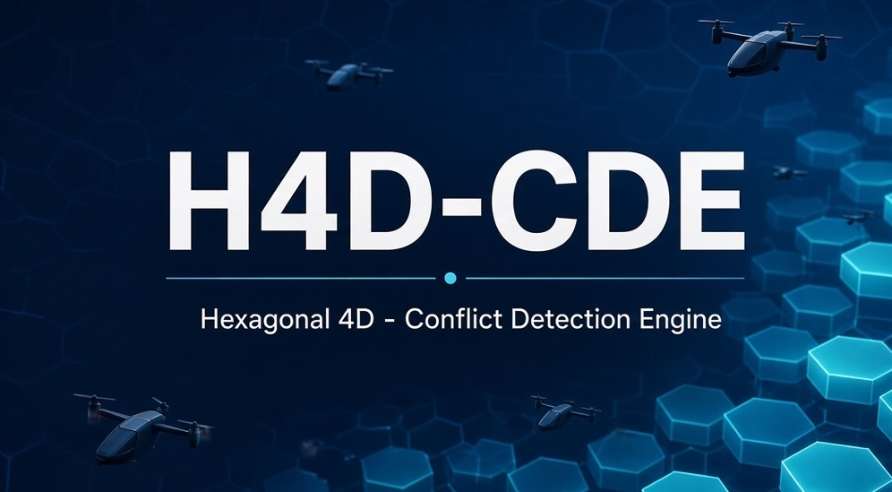

<!-- Banner Placeholder -->

  

# AI-Augmented Hexagonal Voxelization  
### for Scalable Conflict Detection in Urban Air Mobility

 

  
  &nbsp;&nbsp;&nbsp;&nbsp;
  

---

## Overview

Urban Air Mobility (UAM) promises to transform city transportation by moving traffic into the vertical dimension. Realizing this vision, however, depends on solving a critical challenge: **conflict detection must remain fast, accurate, and reliable** as the number of simultaneous operations grows into the hundreds per hour.

This project introduces an intelligent framework that combines **H3 hexagonal geospatial indexing** with **spatiotemporal voxelization** and **artificial intelligence**. The result is a scalable, standards-compatible system for next-generation urban airspace management.

By discretizing airspace into hierarchical hexagonal volumes and augmenting detection with machine learning, the framework achieves dramatic gains in speed and effectiveness while preserving safety.

---

## Key Highlights

- **99.8% reduction** in processing time compared to traditional pairwise methods  
- **Linear (O(n)) complexity** instead of quadratic scaling  
- **Neighbour-aware detection** that captures 80% of conflicts missed by conventional approaches  
- **High-precision trajectory prediction** (15.2 m MAE)  
- **Strong risk discrimination** (0.89 AUC-ROC)  
- **92% first-advisory success rate** for conflict resolution  
- Designed for compatibility with emerging UTM Strategic Conflict Detection standards

---

## Motivation

Traditional conflict detection relies on pairwise trajectory comparisons. As traffic density increases, this approach quickly becomes computationally prohibitive.  

A more scalable alternative is to reason over discrete space-time volumes. Hexagonal grids offer clear advantages over square grids: uniform adjacency, lower quantization error, and natural multi-resolution behaviour.  

When this spatial foundation is combined with modern AI modules for prediction, risk scoring, and advisory generation, the result is a system that is both computationally efficient and operationally intelligent.

---

## Project Impact

The framework provides a practical foundation for high-density Urban Air Mobility operations. It demonstrates that strategic conflict detection can remain tractable and effective even as the number of concurrent flights grows dramatically — a necessary condition for the safe and scalable deployment of UAM in future smart cities.

---

## Authors

**Dr. Deepudev Sahadevan**  
Faculty of Mathematics and Data Science  
Emirates Aviation University, Dubai, UAE  

**Dr. Hannah Al Ali**  
Faculty of Mathematics and Data Science  
Emirates Aviation University, Dubai, UAE  

**Dr. Chilka Mahesh**  
CNS Department  
Airports Authority of India, Kalaburagi Airport, India  

---

## Acknowledgment

This research was supported by Emirates Aviation University, which provided the necessary facilities for conducting the work.

---

© 2026 — Likith Saragadam

