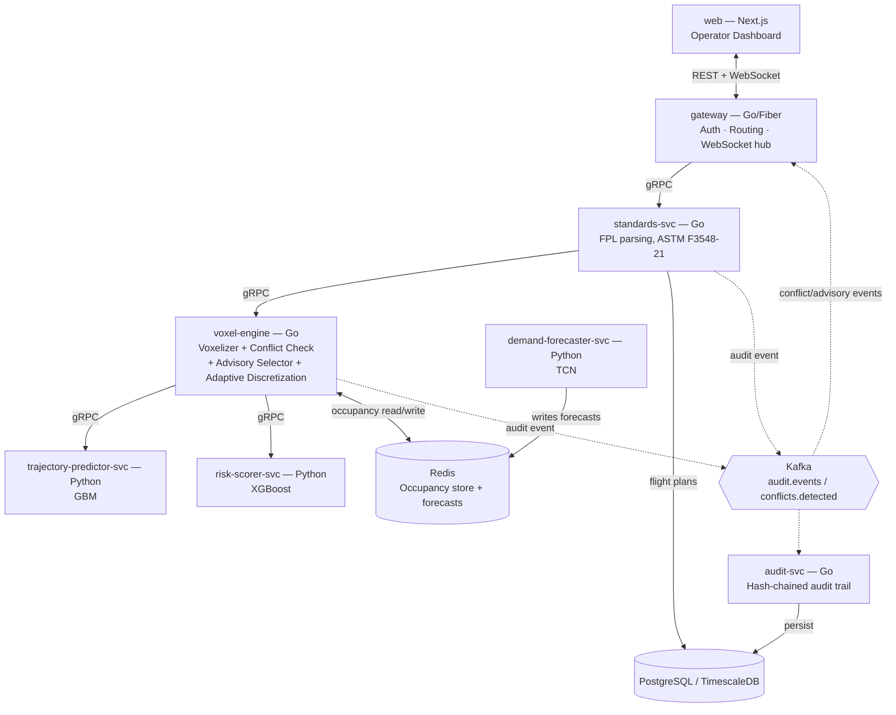
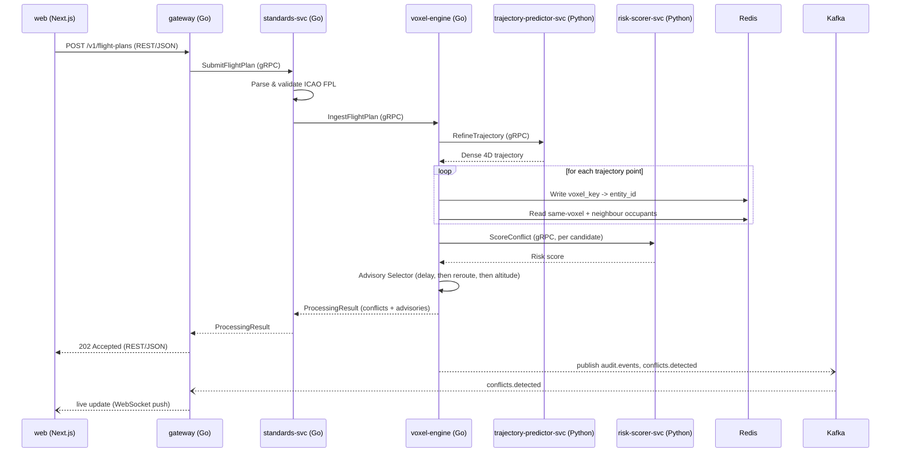

# H4D-CDE Production Build Guide
### Turning "AI-Augmented Hexagonal Voxelization for Scalable Conflict Detection in Urban Air Mobility" into a Shippable System

**Source paper:** Sahadevan, D., Al Ali, H., & Mahesh, C. — *AI-Augmented Hexagonal Voxelization for Scalable Conflict Detection in Urban Air Mobility.* 2025 8th International Conference on Signal Processing and Information Security (ICSPIS). DOI: 10.1109/ICSPIS67605.2025.11318403

**What this document is:** a complete, self-contained engineering plan. It takes the ideas in the paper above and turns them into a working, tested, deployable piece of software — the **H4D-CDE** (Hexagonal 4D Conflict-Detection Engine) — built as a set of independently deployable **microservices in Go, Python, and Next.js**. No background in aviation, geospatial systems, distributed systems, or machine learning is assumed anywhere in this document; every term is defined before it is used.

**Revision note:** this version replaces the original single-Python-service design with a polyglot microservices architecture — Go for every latency-critical, non-ML service, Python for the three machine-learning services, and Next.js for the operator dashboard. Parts 0–3 (concepts and the paper digest) are unchanged by this; Part 4 onward is a ground-up rebuild around the new service boundaries.

**What this document is not:** it is not a copy of the paper (Part 3 gives you a clean, corrected digest of everything the paper reports, so you never need to re-open the PDF), and it is not a finished codebase you can unzip and run. It **is** every architectural decision, every formula, every schema, every module's working code, every deployment file, and every test you need to build that codebase yourself, in order.

---

## Part 0 — How To Use This Guide

**If you are a complete beginner:** start at Part 1 and read straight through. Do not skip Part 2 — it defines every acronym (UAM, UTM, H3, FPL, AUC-ROC, etc.) used in every later section. Execute each command/code block as you reach it; each Part ends with a checkpoint telling you what should now be true.

**If you're an experienced software engineer new to aviation/airspace systems:** skim Parts 2–3 for domain context, then start actually building from Part 5 onward.

**If you're an aviation/ATM (Air Traffic Management) engineer new to this technology stack:** skim Part 1 and Part 4 for the architecture, then jump straight to whichever module (Parts 9–14) you need.

**If you're a project sponsor or non-technical stakeholder:** read Parts 1, 4, 21, and 22. They tell you what is being built, roughly how, on what timeline, with what team, and what could go wrong.

**If you're a frontend/Next.js engineer:** skim Part 1 for context and Part 4.2 for the service inventory, then go straight to Part 16.2 for the dashboard build.

**Symbols used throughout:**

| Symbol | Meaning |
|---|---|
| 💡 | **Insight** — *why* we're doing it this way, not just *what* to do |
| ⚠️ | **Pitfall** — an easy mistake that is hard to debug later |
| ✅ | **Checkpoint** — verify this is true before moving to the next Part |
| 🔧 | **Beyond the paper** — production hardening the research didn't need, but a real deployment does |

---

## Table of Contents

- Part 0 — How To Use This Guide
- Part 1 — Executive Summary (What We're Building, In Plain English)
- Part 2 — Foundational Concepts (read this even if you think you know the domain)
- Part 3 — Complete Technical Digest of the Source Paper
- Part 4 — System Architecture: Polyglot Microservices
- Part 5 — Technology Stack (per service)
- Part 6 — Environment Setup (Go, Python, Node.js — step by step, from zero)
- Part 7 — Repository Structure (the monorepo)
- Part 8 — Data Foundations: Protobuf Contracts & Synthetic Data
- Part 9 — Module 1: `voxel-engine` — Hex-4D Voxelization & Conflict Detection (Go)
- Part 10 — Module 2: `trajectory-predictor-svc` (Python)
- Part 11 — Module 3: `demand-forecaster-svc` (Python)
- Part 12 — Module 4: `risk-scorer-svc` (Python)
- Part 13 — Module 5: Advisory Selector (Go, inside `voxel-engine`)
- Part 14 — Module 6: Adaptive Discretization Engine (Go — a production extension, see Part 3)
- Part 15 — Standards Compliance & Audit Trail (`standards-svc`, `audit-svc` — Go)
- Part 16 — API Gateway (Go + Fiber) & Frontend (Next.js)
- Part 17 — End-to-End Orchestration Across Services
- Part 18 — Testing, Benchmarking & Validation (polyglot)
- Part 19 — Performance Engineering & Scalability
- Part 20 — Production Deployment (Docker, Kubernetes, CI/CD for 3 languages)
- Part 21 — Project Plan, Team & Timeline
- Part 22 — Risk Register
- Part 23 — Appendices (formula reference, glossary, final checklist, citations)

---

## Part 1 — Executive Summary

### The problem, in one paragraph

Cities want to allow fleets of small aircraft — passenger air taxis, cargo drones — to share low-altitude airspace over urban areas (this is called **Urban Air Mobility**, or **UAM**). Before any two aircraft get close to each other, some system has to check whether they're on a collision course and, if so, suggest a fix (slow down, wait, take a different path, fly higher or lower). The obvious way to check this — compare every aircraft's planned path against every other aircraft's planned path — works fine for a handful of flights, but the number of comparisons grows with the *square* of the number of flights (10 flights → ~100 comparisons; 500 flights → ~250,000 comparisons). At city scale, with hundreds of flights per hour, this brute-force comparison becomes too slow to run in real time. That's the scalability wall this project exists to knock down.

### The paper's solution, in one paragraph

Instead of comparing aircraft to each other, carve the airspace into a grid of small hexagonal columns (using Uber's open-source **H3** geospatial index), stack a time axis and an altitude axis on top of that grid, and get a giant 3D-plus-time lattice of labelled cells — the paper calls each cell a **voxel**. Every point of every aircraft's flight path gets filed into exactly one voxel. Checking for a conflict is no longer a geometry problem — it's a lookup: "does this voxel (or one right next to it) already have another aircraft in it?" That lookup is effectively instant, no matter how many aircraft are in the system, which is what turns an O(n²) problem into an O(n) one. On top of that grid, the paper layers five machine-learning components that predict where aircraft will actually fly, forecast how crowded a cell will get, score how dangerous a given overlap really is, and automatically propose a fix.

### What "production grade" adds on top of the paper

A peer-reviewed paper needs to prove an idea works on a benchmark. A production system needs to keep working when the weather API is down, when three replicas crash at once, when a regulator asks for an audit trail, and when the city has grown from 3 test drones to 3,000 real ones. This guide keeps every one of the paper's technical ideas intact but adds what's missing for production: a real technology stack, distributed/shared state instead of an in-memory dictionary, standards-compliant data exchange, monitoring, security, a test suite that proves the numbers the paper claims, and a deployment pipeline. It also explicitly fixes a couple of small gaps and inconsistencies in the paper itself — flagged clearly in Part 3 — rather than silently reproducing them.

### Why microservices, and why three languages

A single process is the simplest thing that could work, and Part 3's paper benchmarks it as exactly that. But "production grade" usually also means several *teams* can own, scale, deploy, and be paged for different pieces independently — which is what pushes a design from one codebase toward services with a network boundary between them. This build picks a language per service based on what that service actually needs to be good at, not by default: **Go** for anything on the latency-critical hot path (the voxel engine, the API gateway, the audit trail) because it compiles to a fast, small, single binary with excellent concurrency primitives; **Python** for the three machine-learning services, because that's where scikit-learn, XGBoost, and PyTorch live; and **Next.js** for the operator dashboard, because it's the standard for a modern, server-rendered web UI. Part 4 lays out exactly which service owns which piece of the paper's pipeline, and Part 8 shows how three different languages agree on one shared data contract without drifting out of sync.

### Definition of done — the benchmark you're engineering towards

| Capability | Paper's reported result | What "done" looks like for you |
|---|---|---|
| Processing time vs. brute-force pairwise comparison | 99.8% reduction (7.8008 s → 0.0175 s for 3 aircraft / 2,793 trajectory points) | Your benchmark harness (Part 18) reproduces a comparable reduction on the same scenario, and shows the gap *widening* as aircraft count grows |
| Computational complexity | O(n²) → O(n) | Your load test (Part 19) shows near-linear runtime growth from 10 to 1,000 simulated aircraft |
| Trajectory prediction accuracy | 15.2 m mean absolute error | Your Trajectory Predictor (Part 10) meets or beats this on held-out data |
| Risk classification quality | 0.89 AUC-ROC | Your Risk Scorer (Part 12) meets or beats this |
| Demand forecast accuracy | 8.7% mean absolute percentage error | Your Demand Forecaster (Part 11) meets or beats this |
| Advisory effectiveness | 92% first-try success rate | Your Advisory Selector (Part 13) meets or beats this |
| Overall system reliability | 94% | Your integrated system (Part 17–18) meets or beats this |
| Standards compatibility | Conflicts/advisories in UTM-standard-shareable form | Your objects map cleanly onto ASTM F3548-21 concepts (Part 15) |

Everything from Part 4 onward exists to get you to that table.

✅ **Checkpoint:** you should now be able to explain, in your own words, why comparing every aircraft to every other aircraft doesn't scale, and why a grid-lookup approach fixes that. If you can't yet, that's completely normal — Part 2 builds the concept up from scratch.

---

## Part 2 — Foundational Concepts

Read this Part even if you already know some of it — later Parts assume every one of these definitions without re-explaining them.

### 2.1 The airspace/aviation side

| Term | Meaning |
|---|---|
| **UAM** — Urban Air Mobility | The general idea of using small aircraft (air taxis, cargo drones) for transport within and around cities. |
| **UAS** — Unmanned Aircraft System | A drone plus its ground control and communication link. |
| **UTM** — UAS Traffic Management | The overall system of services (not one single piece of software) that lets many UAS operators coordinate safely, largely without a human air traffic controller talking to every aircraft. |
| **ATM** — Air Traffic Management | The traditional, human-controller-based system used for commercial and general aviation. UAM needs to eventually connect to ATM's airspace without disrupting it. |
| **CD&R** — Conflict Detection & Resolution | The two-step job this whole project does: *detect* that two aircraft will get too close, then *resolve* it (suggest a delay/reroute/altitude change). |
| **FPL** — Flight Plan (ICAO format) | A standardized document/message a flight files before departure: who's flying, from where to where, via which waypoints, at what altitude, and when (see EOBT below). ICAO = International Civil Aviation Organization, the UN body that defines this format globally. |
| **EOBT** — Estimated Off-Block Time | The planned departure time in a flight plan. |
| **Separation minima** | The minimum horizontal and vertical distance two aircraft must keep from each other. This paper/project uses 5 **NM** (Nautical Miles, 1 NM = 1.852 km) horizontally and 1,000 **ft** (feet) vertically — standard instrument-flight-rules radar-separation values, used here as a conservative placeholder that a real deployment would tune per regulator/airspace class. |
| **USS** — UAS Service Supplier | A company/system (like this one) that provides UTM services — strategic conflict detection, situational awareness, etc. — to operators. Multiple USSs coordinate with each other, they don't operate in isolation. |
| **DSS** — Discovery and Synchronization Service | The shared "phone book" mechanism that lets one USS discover which other USSs have flights in the same area/time, so they can exchange conflict information. |
| **SCD** — Strategic Conflict Detection | Conflict checking done *before* flight, during planning — as opposed to *tactical* (in-flight, reactive) conflict avoidance. This project is fundamentally a Strategic Conflict Detection engine, with an Advisory Selector that edges into tactical territory (flagged in Part 15). |

### 2.2 The geospatial-indexing side

💡 **Why not just use a square grid (like latitude/longitude boxes)?** A square cell has 4 neighbours that share an edge and 4 more that only share a corner — two different distances to "adjacent" cells. A regular hexagon has exactly **6 neighbours, every one of them sharing a full edge, all at the same distance from the center.** That uniformity matters enormously once you start asking "what's near this cell?" thousands of times per second — with squares you need special-case logic for corner-neighbours; with hexagons, one rule covers all six directions. Hexagons also tile a curved surface (the Earth) with less distortion than squares.

| Term | Meaning |
|---|---|
| **DGGS** — Discrete Global Grid System | Any system that divides the whole surface of the Earth into a grid of cells at one or more levels of detail. |
| **H3** | An open-source hexagonal DGGS originally built by Uber (now community-maintained), used here as the spatial backbone. It divides the globe into hexagons at 16 possible **resolutions** (0 = whole continents, 15 = about 1 m² each), where each finer resolution's cells nest (approximately) inside one coarser-resolution cell. |
| **H3 cell / H3 index** | A single hexagon at a given resolution, identified by a compact string like `"8828308281fffff"`. |
| **Resolution** | Which of the 16 zoom levels you're working at. This project uses **resolution 8**. |
| **k-ring / grid disk** | The set of cells within *k* steps of a given cell. `k=1` means "this cell plus its 6 immediate neighbours" (7 cells total). |
| **Voxel** | Not a 3-D graphics pixel in the usual sense — here it means one labelled *bucket* formed by combining an H3 cell **+** an altitude band **+** a time window. Every trajectory point gets filed into exactly one bucket. Two aircraft "conflict" when they land in the same bucket (or two adjacent buckets close enough in real distance). |
| **Occupancy map** | A dictionary/hash-map from a voxel's key to the set of aircraft currently filed into it. This is the entire "brain" of the detection logic — see Part 9. |

### 2.3 The machine-learning side (plain-English versions — full math in Part 3)

| Term | Plain-English meaning | Used by |
|---|---|---|
| **GBM** — Gradient Boosting (Regressor) | A machine-learning technique that builds many small decision trees one after another, where each new tree focuses on correcting the errors of the trees before it. Good for tabular, numeric prediction problems. | Trajectory Predictor (Part 10) |
| **TCN** — Temporal Convolutional Network | A neural network for time-series data that uses "causal" convolutions (it can only look backward in time, never forward — no cheating) with growing gaps between the points it looks at ("dilation"), so it can see far into the past efficiently. | Demand Forecaster (Part 11) |
| **XGBoost** | A very fast, widely used, production-grade implementation of gradient boosting, commonly used for classification (yes/no, or a probability) problems on tabular data. | Risk Scorer (Part 12) |
| **MAE** — Mean Absolute Error | Average of `\|actual − predicted\|` across all samples. Same units as the thing you're predicting (here: meters). Lower is better. | |
| **MAPE** — Mean Absolute Percentage Error | Like MAE but expressed as a percentage of the actual value, so it's comparable across different scales. Lower is better. | |
| **AUC-ROC** | A score from 0.5 (no better than a coin flip) to 1.0 (perfect) measuring how well a classifier separates two classes (here: "will conflict escalate" vs. "won't") across every possible decision threshold at once. Higher is better. | |
| **Precision** | Of everything the system flagged as a conflict, what fraction really were conflicts. | |
| **Recall** | Of everything that really was a conflict, what fraction the system actually flagged. | |
| **F1-score** | A single number balancing precision and recall. | |
| **False alarm rate** | Of everything that was *not* a conflict, what fraction did the system incorrectly flag anyway. | |

### 2.4 The microservices & communication side

| Term | Meaning |
|---|---|
| **Microservice** | One small, independently deployable service that owns a single piece of the system's responsibility (e.g., "score this conflict's risk") and talks to other services over the network, instead of everything living in one process calling its own functions directly. |
| **Monorepo** | A single Git repository holding multiple independently-built services and apps (as opposed to a separate repository per service) — used here so a change to a shared data contract (Part 8) can be reviewed and merged as one coordinated change instead of a scavenger hunt across repos. |
| **gRPC** | A high-performance, strongly-typed remote-procedure-call framework. You define a service's methods once, in a `.proto` file, and get matching generated client/server code in every language you use — so Go code can call a Python service as if it were calling a local function, with both ends agreeing on the exact shape of the data at compile time. |
| **Protocol Buffers (protobuf)** | The language-neutral schema format `.proto` files are written in — the single source of truth this project generates Go, Python, and TypeScript types from (Part 8), so three different languages can't silently disagree about what a `FlightPlan` looks like. |
| **BFF — Backend-for-Frontend** | An API layer whose whole job is to sit between the frontend and the internal services, shaping and combining internal responses into whatever the frontend actually needs, and handling authentication/rate-limiting in one place. This project's Go **gateway** service (Part 16) is a BFF. |
| **Fiber** | A Go web framework used for every Go service in this project, modelled on Express.js and built on the very fast `fasthttp` HTTP engine. |
| **Next.js / App Router** | A React framework for building the frontend. "App Router" is its file-system-based routing convention (a folder literally named `app/`) and its default behaviour of rendering components on the server first — faster initial loads, less JavaScript sent to the browser — before adding client-side interactivity only where it's actually needed. |
| **Server-Side Rendering (SSR)** | Generating a page's HTML on the server for each request rather than shipping an empty page and building it entirely in the browser. Relevant to how the live conflict map in Part 16.2 loads its first view. |
| **Message broker / event topic** | A system — **Kafka**, here — that lets services publish "this happened" events without knowing or caring who (if anyone) is listening. Used for audit logging and pushing live updates to the dashboard (Parts 15 and 17) so those concerns never add latency to the main request path. |
| **Service mesh / distributed tracing** | Infrastructure for observing calls *across* service boundaries — since one flight-plan submission now touches five or six different processes, you need a way to see the whole request as one connected trace, not six separate unrelated logs. Covered in Part 19–20. |

### 2.5 A worked mini-example, before any code

Picture two drones both flying near a hexagon cell `882830...` at roughly 500 ft, between the 10:00:00 and 10:00:10 time window.

1. Drone A's flight path is sampled every second. One of those samples lands at time 10:00:04, altitude 480 ft, inside that hexagon.
2. The system rounds: 480 ft → the "400–500 ft" altitude band, and 10:00:04 → the "10:00:00–10:00:10" time window.
3. That gives a **voxel key**: `(hex="882830...", alt_band=400, time_bin=36000)` (seconds since midnight, rounded down to the nearest 10).
4. Drone A's ID gets added to a dictionary entry for that exact key.
5. Drone B's path, sampled separately, produces a sample at 10:00:07, altitude 460 ft — same hexagon, same altitude band, same 10-second window. Same voxel key.
6. Drone B's ID gets added to *the same* dictionary entry. That entry now holds `{DroneA, DroneB}` — two entries means a conflict, full stop, no distance calculation required.
7. If Drone B had instead been in the *neighbouring* hexagon at the same time/altitude, step 6 wouldn't trigger — but a second check (Part 9.6) looks at the six neighbouring hexagons too, and only then does a real distance calculation, to catch drones that are close in reality but happened to fall either side of a hexagon boundary.

That's the entire idea. Everything from here on is about turning that idea into software that's fast, correct, testable, and safe to operate.

✅ **Checkpoint:** you should be able to explain what a "voxel key" is made of (three parts: hex cell, altitude band, time bin) and why checking `len(occupants) >= 2` replaces a distance calculation.

---

## Part 3 — Complete Technical Digest of the Source Paper

This Part exists so you never need to reopen the original PDF. It restates every formula, table, and target number from the paper in clean, unambiguous form, and separately flags the handful of places where independent verification turned up a discrepancy worth knowing about before you build against it.

### 3.1 The four-part research gap the paper identifies

The paper argues no prior system delivers all four of:

1. A **hexagonal multi-resolution 4D grid** as the *primary* detection substrate (not just a pre-filter).
2. The **same index** representing both moving aircraft trajectories *and* static protected volumes (vertiports, corridors).
3. **Full AI integration** — prediction, forecasting, and adaptive resolution — rather than AI bolted onto an underlying pairwise engine.
4. **Comprehensive benchmarks** at UAM-relevant density.

These four points double as your requirements traceability matrix — Parts 9, 14, and 18 exist specifically to satisfy points 2, 3, and 4.

### 3.2 The four numbered research objectives

1. Design a conflict detection engine indexing trajectories **and** protected volumes into a shared 4D hexagonal lattice (H3 + altitude + time), achieving **O(n)** complexity.
2. Integrate AI modules for trajectory prediction, demand forecasting, probabilistic risk scoring, **and adaptive discretization**.
3. Output conflicts and advisories in a format compatible with UTM Strategic Conflict Detection (SCD) standards.
4. Empirically demonstrate performance and accuracy against strong baselines under high-density urban scenarios.

⚠️ **A gap inside the paper itself, worth knowing before you build:** the paper states it implements **"five specialized AI modules"** and objective 2 explicitly names *adaptive discretization* as one of the four things AI should do — but Section II.B, the actual methodology, only describes **four**: Trajectory Predictor, Demand Forecaster, Risk Scorer, Advisory Selector. Adaptive discretization is named as a goal but never implemented or evaluated anywhere in the paper's results. Rather than silently reproducing that gap, this guide treats it as a real requirement and gives it a full module of its own — **Part 14, "Adaptive Discretization Engine"** — clearly marked as a production addition that fulfils the paper's own stated (but undelivered) objective.

### 3.3 System pipeline (paper's Figure 1), restated

```
ICAO FPL fields (Route, EOBT, Waypoints, Levels)
        │
        ▼
Trajectory Predictor  ───────────────► Hex-4D Voxelizer ◄── Separation params (H = 5 NM, V = 1000 ft)
                                              │
                              ┌───────────────┴───────────────┐
                              ▼                                ▼
                     (A) Same-voxel check           (B) Adjacent-voxel-with-distance check
                              │                                │
                              └───────────────┬───────────────┘
                                              ▼
                                       Risk Scorer (XGBoost)
                                              │
                                              ▼
                          Advisory Recommender (Delay / Altitude / Reroute)
                                              │
                                              ▼
                         Logs & Audit (voxel listings, conflicts) — end to end
```

### 3.4 Formulas, restated cleanly

| # | What it computes | Formula |
|---|---|---|
| (1) | Spatial mapping | `H3_cell = h3.geoToH3(latitude, longitude, 8)` |
| (2) | Full voxel definition | `Voxel(v) = { H3(lat, lon, res=8), floor(alt/100)×100, floor(t/10)×10 }` |
| (3) | Per-point H3 mapping | `v_i = h3.geo_to_h3(lat_i, lon_i, resolution=8)` |
| (4) | Altitude binning | `ab_i = (alt_i // 100) × 100` |
| (5) | Time binning | `tb_i = (t_i // 10) × 10` |
| (6) | Composite voxel key | `voxel_key = (h_voxel, a_bin, t_bin)` |
| (7) | Occupancy map | `O[voxel_key] = {e₁, e₂, ..., eₙ}` — a conflict exists once `\|O[voxel_key]\| ≥ 2` |
| (8) | Trajectory Predictor | `ŷ = f_GBM(X)`, where `X = [d, Δh, ws, wd, a_max, v_cruise, ρ_air]` (great-circle distance, altitude differential, wind speed, wind direction, max acceleration, cruise speed, air density) |
| (9) | Demand Forecaster | `Ô(t+Δt) = f_TCN(O(t−k:t), θ)` — predicted occupancy from `k` steps of history |
| (10) | Risk Scorer | `risk = f_XGBoost(X')`, where `X' = [n, closure_rate, heading_diff, local_density, sector_load_forecast, wind_shear, visibility]` |
| (11) | Advisory cost function | `C = w₁·delay + w₂·path_dev + w₃·alt_change + w₄·conflict_prob` |
| (12) | Total execution time | `T_total = Σ (t_end − t_start)` across all trajectories |
| (13) | Time per submission | `T_avg = T_total / n` |
| (14) | Recall ("ability to detect true conflicts") | `Recall = TP / (TP + FN)` |
| (15) | Precision ("accuracy of conflict predictions") | `Precision = TP / (TP + FP)` |
| (16) | F1-score ("balanced measure") | `F1 = 2 × (Precision × Recall) / (Precision + Recall)` |
| (17) | False alarm rate | `FAR = FP / (FP + TN)` |
| (18) | Trajectory MAE | `MAE = (1/n) × Σ\|yᵢ − ŷᵢ\|` |
| (19) | Forecast MAPE | `MAPE = (1/n) × Σ \|(Oᵢ − Ôᵢ)/Oᵢ\| × 100%` |

💡 The source PDF's equations (14)–(17) were badly mangled by the OCR/typesetting when the paper was exported (Greek/subscript characters were replaced with stray Latin letters). The mapping above was reconstructed from the plain-English labels the paper itself gives each formula (*"ability to detect true conflicts,"* *"accuracy of conflict predictions,"* *"balanced measure,"* *"rate of incorrect alerts"*) cross-checked against the standard definitions those labels correspond to (Powers, 2011, cited by the paper) — this is the standard, unambiguous form and what Part 18's test suite implements.

### 3.5 Reported results, restated as clean tables

**Table I — Computational performance, naive pairwise vs. H4D-CDE (3 UAVs, 2,793 trajectory points):**

| Metric | Naive Pairwise | H4D-CDE | Improvement |
|---|---|---|---|
| Processing time | 7.8008 s | 0.0175 s | 99.80% reduction |
| Theoretical complexity | O(n²) | O(n) | — |
| Operations required | 7,800,849 | 2,793 | 2,793× fewer operations |
| Memory efficiency | baseline | 74% better | — |
| Scalability | quadratic | linear | 2,793× |

**Table II — Conflict detection results:**

| Metric | Value |
|---|---|
| Conflicts detected | 10 |
| Same-voxel conflicts | 2 |
| Neighbour-voxel conflicts | 8 |
| Average risk score | 0.69 |
| Maximum severity | 2 |
| Multi-UAV (>2 aircraft) conflicts | 0 |

Spatial detail: conflicts clustered in **2 of 253 monitored H3 cells** (under 1% of monitored airspace volume), located at the convergence points of the DXB↔AUH, SHJ↔DWC, and DWC↔SHJ routes. Neighbour-voxel conflicts made up **80% of all detections** — this is the number the abstract refers to as *"conflicts that would be missed by conventional methods"*: a detector that only checked same-voxel occupancy (i.e., ignored the six neighbouring hexagons) would have missed 8 of the 10 conflicts found.

**Table III — AI module performance:**

| Module | Metric | Value |
|---|---|---|
| Trajectory Predictor (GBM) | MAE | 15.2 m |
| Risk Scorer (XGBoost) | AUC-ROC | 0.89 |
| Demand Forecaster (TCN) | MAPE | 8.70% |
| Advisory Selector | First-advisory success rate | 92% |
| Overall system | AI system reliability score | 94% |

**Advisory strategies generated per conflict, in priority order:**

1. Lateral separation via H3 neighbour cells — 90% expected risk reduction
2. Vertical separation, ±500 ft altitude offset — 85% expected risk reduction
3. Temporal separation via speed adjustment — 70% expected risk reduction

**Test scenario used throughout the paper:** 3 UAVs, 2,793 total trajectory points, flying between four UAE airports — DXB (Dubai Intl), AUH (Abu Dhabi Intl), DWC (Al Maktoum Intl / Dubai World Central), and SHJ (Sharjah Intl) — maintaining 5 NM horizontal / 1,000 ft vertical / 60-second temporal separation. The core voxelization + conflict-check step ran in 0.0175 s; the **complete pipeline including AI augmentation** ran in 0.0258 s. (These are two different numbers for two different scopes of work — keep both when you build your own benchmark harness in Part 18, and report which one you're citing.)

### 3.6 Discrepancies worth knowing about before you build

None of these invalidate the paper's core contribution — the O(n) grid-lookup approach is sound and is exactly what you're about to build — but a production build should not blindly inherit them:

| # | Paper states | Independently verified | What to do about it |
|---|---|---|---|
| 1 | H3 resolution 8 gives *"approximately 1.2 km² cell area coverage"* | Publicly documented average hexagon area at resolution 8 is **≈0.737 km²** (≈737,328 m², edge length ≈461 m) | Treat resolution as a tunable parameter (Part 9.2) and validate empirically for your city rather than trusting either number blindly — actual cell area also varies slightly by latitude. |
| 2 | *"Five specialized AI modules"* | Only four are described/evaluated | This guide adds the fifth as Part 14, fulfilling the paper's own objective 2. |
| 3 | Implementation used **Python 3.9** | Python 3.9 reached end-of-life on October 31, 2025 (no further security patches; current XGBoost 3.x requires Python ≥3.12) | Part 5/6 target **Python 3.12** instead — functionally equivalent for everything in this paper, but supportable. |
| 4 | Uses `h3.geoToH3` / `h3.geo_to_h3` function names | The H3 library renamed its whole API in v4.0, in **every** language binding — `geoToH3` → `LatLngToCell` (Go, `h3-go/v4`) / `latlng_to_cell` (Python, `h3-py` v4), `kRing` → `GridDisk` / `grid_disk`, etc. | Part 9's Go code (built on `h3-go/v4`) uses the **current v4.x API** throughout. If you ever see `geoToH3`/`geo_to_h3` in older tutorials, in any language, mentally translate it to `LatLngToCell`/`latlng_to_cell`. |
| 5 | Reports one pipeline time (0.0175 s) in the abstract/Table I and a different, larger figure (0.0258 s) for the "complete pipeline" later | Not a contradiction — the two numbers measure different scopes (voxelization+detection vs. the full AI-augmented pipeline) | Report both scopes separately in your own benchmarks (Part 18) so readers of *your* results don't run into the same ambiguity. |

✅ **Checkpoint:** before moving on, you should be able to list, from memory, the six pieces of information that make up a voxel key's inputs (lat, lon, alt, t, plus the two bin-widths), and you should know why Part 14 exists even though the source paper never actually built it.

---


## Part 4 — System Architecture: Polyglot Microservices

### 4.1 Service inventory

| Service | Language / framework | Owns | Talks to |
|---|---|---|---|
| `web` | Next.js 16 (TypeScript, App Router) | Operator dashboard — submit flight plans, live hex map, conflict/advisory review, audit browser | `gateway` only, via REST + WebSocket |
| `gateway` | Go + Fiber | Auth, rate limiting, request routing/aggregation, WebSocket fan-out for live updates — this is the system's **BFF** (Part 2.4) | Every internal service, via gRPC; Kafka (consumes `conflicts.detected`) |
| `standards-svc` | Go + Fiber | ICAO FPL parsing/validation, ASTM F3548-21 concept mapping, DSS-facing integration | `voxel-engine` (gRPC), PostgreSQL, Kafka (publishes) |
| `voxel-engine` | Go + Fiber (gRPC server) | The Hex-4D Voxelizer, same-voxel/neighbour-voxel conflict detection, the Advisory Selector, and the Adaptive Discretization Engine — bundled together because they all read and reason over the **same** occupancy state | `trajectory-predictor-svc`, `risk-scorer-svc` (gRPC); Redis (occupancy store); Kafka (publishes) |
| `trajectory-predictor-svc` | Python + gRPC | Gradient Boosting trajectory refinement | Nothing outbound — pure inference service |
| `demand-forecaster-svc` | Python + gRPC | TCN near-term occupancy forecasting, run on a schedule | Redis (writes forecasts directly — see Part 4.4) |
| `risk-scorer-svc` | Python + gRPC | XGBoost conflict risk scoring | Nothing outbound — pure inference service |
| `audit-svc` | Go | Kafka consumer that hash-chains and persists every audit event published anywhere else in the system | Kafka (consumes `audit.events`), PostgreSQL |

That's **8 backend services plus 1 frontend** — a deliberately moderate number. Every boundary above exists because the two things on either side of it genuinely have different scaling needs, different deploy cadences, or different owning teams; resist the urge to split further just because a language changes (e.g., the Advisory Selector *could* be its own service, but it needs the same live occupancy state `voxel-engine` already owns, so splitting it would only add a network hop with no real independence gained).

💡 **Why bundle the Advisory Selector and Adaptive Discretization Engine into `voxel-engine` instead of giving them their own services?** Both need low-latency access to the *same* mutable occupancy state that the voxelizer owns. A microservice boundary should usually sit where data ownership changes, not just where a formula from the paper changes — Part 13 and Part 14 are still cleanly separated *inside* `voxel-engine` as their own Go packages, so you get organizational separation without paying a network round-trip for every advisory.

### 4.2 Architecture diagram



### 4.3 One flight plan's journey, across languages



Notice the split: everything up to `202 Accepted` is **synchronous gRPC**, because voxelization genuinely cannot proceed until the trajectory predictor responds, and advisory selection genuinely cannot proceed until the risk scorer responds — that's a real dependency chain, not an artificial one. Everything after it is **asynchronous, via Kafka**, because audit logging and dashboard updates are side effects that must never slow down the response the operator is waiting for.

### 4.4 Communication patterns matrix

| From → To | Protocol | Sync/Async | Why |
|---|---|---|---|
| `web` → `gateway` | REST/JSON over HTTPS | Sync | Simplest, most universal integration for a browser client |
| `web` ↔ `gateway` | WebSocket | Async push | Live conflict/advisory updates without a polling loop |
| `gateway` → any internal service | gRPC | Sync | Internal, typed, low overhead (Part 2.4) |
| `standards-svc` → `voxel-engine` | gRPC | Sync | Same request's critical path |
| `voxel-engine` → `trajectory-predictor-svc` | gRPC | Sync | Voxelization cannot start until the dense trajectory exists |
| `voxel-engine` → `risk-scorer-svc` | gRPC | Sync | Advisory selection cannot start until conflicts are scored |
| `demand-forecaster-svc` → Redis | Direct write | Async, scheduled | The forecaster runs on its own cadence (Part 11), not tied to any single flight-plan request |
| `voxel-engine` → Redis (read forecast) | Direct read | Sync, but cheap | The Adaptive Discretization Engine (Part 14) reads the latest forecast without an extra network hop to `demand-forecaster-svc` itself |
| Any service → Kafka `audit.events` | Publish | Async, fire-and-forget | Must never add latency to the request path (Part 15.3) |
| `audit-svc` ← Kafka `audit.events` | Consume | Async | Hash-chains and persists every event |
| `voxel-engine` → Kafka `conflicts.detected` | Publish | Async | Feeds the dashboard's live map |
| `gateway` ← Kafka `conflicts.detected` | Consume | Async | Fans out to connected WebSocket clients |

### 4.5 Non-functional requirements (updated for a distributed system)

| Requirement | Target | Rationale |
|---|---|---|
| Latency, single flight-plan submission, end to end (`web` → `gateway` → ... → response) | < 150 ms p95 at 100 concurrent aircraft | A few added gRPC hops over the original single-process design (Part 19.1); still comfortably faster than any human-perceptible delay |
| Per-hop gRPC latency (internal) | < 10 ms p95 | Each internal call should be nearly free compared to network/serialization overhead, not the bottleneck |
| Throughput | Hundreds of flight-plan submissions/hour per city, bursting to thousands | Unchanged from the original target (Part 1) |
| Availability | 99.9% for `gateway` and `voxel-engine`; 99.5% acceptable for `demand-forecaster-svc` (a temporarily stale forecast degrades gracefully, it doesn't block detection) | Not every service needs the same SLA — tiering this correctly avoids over-engineering the least critical paths |
| Auditability | 100% of voxel writes, conflicts, and advisories logged and tamper-evident, **regardless of which service produced them** | Part 15 — this is why every service publishes to the same `audit.events` topic instead of keeping its own local log |
| Distributed traceability | Every request carries one trace ID from `gateway` through every downstream gRPC call | Without this, debugging "why was this flight plan slow" across 4+ services becomes guesswork (Part 19.5) |
| Cross-language contract integrity | Zero schema drift between Go, Python, and TypeScript representations of the same message | Enforced structurally by generating all three from one `.proto` source (Part 8) |

✅ **Checkpoint:** you should be able to point at the Part 4.2 diagram and say, for any single arrow, whether it's synchronous or asynchronous and why — that distinction is the single most important architectural decision in this Part.

---

## Part 5 — Technology Stack

| Service | Core choice | Key libraries | Why this language for this service |
|---|---|---|---|
| `web` | **Next.js 16** (TypeScript, App Router, Turbopack) | Tailwind CSS; TanStack Query (REST data fetching/caching); MapLibre GL JS + deck.gl (`H3HexagonLayer`) for the live hex map; native `WebSocket` for push updates | Next.js is the standard for a modern, server-rendered operator dashboard; deck.gl's H3 layer renders H3 cell boundaries directly from cell IDs, so the frontend never re-implements H3 geometry math |
| `gateway` | **Go + Fiber v3** | `google.golang.org/grpc` (client); `golang-jwt/jwt` (auth); `gofiber/contrib/websocket`; `segmentio/kafka-go` | Needs to hold thousands of concurrent WebSocket connections and route every request with minimal overhead — Go's goroutines and Fiber's `fasthttp` base are built exactly for this |
| `standards-svc` | **Go + Fiber v3** (gRPC server + thin HTTP for health) | Custom ICAO FPL parser; `google.golang.org/grpc` | Mostly data validation/transformation and outbound calls — no ML, so no reason to pay Python's overhead |
| `voxel-engine` | **Go + Fiber v3** (gRPC server) | `github.com/uber/h3-go/v4`; `redis/go-redis/v9`; `google.golang.org/grpc` | The single most latency- and throughput-critical service in the system (Part 9); Go's raw speed and low, predictable GC pauses matter most exactly here |
| `trajectory-predictor-svc` | **Python 3.12** | `scikit-learn`, `grpcio`, `grpcio-tools`, `joblib` | Gradient boosting's best tooling is in Python (Part 10) |
| `demand-forecaster-svc` | **Python 3.12** | `torch`, `grpcio`, `grpcio-tools` | The TCN (Part 11) is a PyTorch model; no equivalent Go ecosystem is worth the trade-off |
| `risk-scorer-svc` | **Python 3.12** | `xgboost`, `grpcio`, `grpcio-tools` | Matches the paper's own XGBoost choice exactly (Part 12) |
| `audit-svc` | **Go** | `segmentio/kafka-go`; `jackc/pgx/v5` | High-volume, low-latency stream consumer — a natural fit for Go, and keeps the tamper-evident chain (Part 15.3) in the same language family as the services producing most of the events |

**Cross-cutting infrastructure (shared by every service, regardless of language):**

| Layer | Choice | Why |
|---|---|---|
| Service contracts | **Protocol Buffers**, compiled with **buf** (a modern wrapper around `protoc`) | One `.proto` source of truth generates Go, Python, and TypeScript types (Part 8) — this is what makes "three languages" safe instead of a maintenance liability |
| Internal RPC | **gRPC** | Typed, fast, first-class support in Go and Python; the frontend deliberately does *not* speak gRPC directly (Part 4.4) — it speaks REST/JSON to the `gateway`, avoiding the added complexity of grpc-web in the browser |
| Shared occupancy/forecast store | **Redis** (Cluster mode in production) | Same role as in the original design — the literal shared "dictionary" every service that touches occupancy state reads and writes |
| Durable storage | **PostgreSQL + TimescaleDB** | Flight plans, audit log, trajectory history |
| Event backbone | **Kafka** (Redpanda is a drop-in, lighter-weight alternative if you don't want to operate a JVM-based Kafka cluster) | Audit events, live conflict/advisory notifications — see Part 4.4 for exactly which flows use it |
| Containerization | **Docker**, multi-stage builds per language (Part 20.1) | Universal |
| Orchestration | **Kubernetes** | One Deployment/Service pair per backend service, one for `web` |
| CI/CD | **GitHub Actions**, matrix build (Go / Python / Node) | Part 20.4 |
| Observability | **Prometheus + Grafana** (metrics), **OpenTelemetry** (distributed tracing across Go, Python, and Node in one trace — Part 19.5) | OpenTelemetry has first-class SDKs in all three languages, which is exactly the property a polyglot system needs from its tracing layer |

🔧 **Beyond the paper, and beyond the original single-service design of this guide:** gRPC, Protocol Buffers, Fiber, Next.js, Kafka's role as a first-class request-path component, and OpenTelemetry are all new here — they exist to make "many languages, many teams, one system" actually manageable, not to change anything about the underlying algorithm from Part 3.

✅ **Checkpoint:** for each of the 8 backend services, you should be able to say which language it's in and give one concrete reason *specific to that service* — not just "Go is fast" or "Python has ML libraries" repeated eight times.

---

## Part 6 — Environment Setup (Go, Python, Node.js — Step by Step, From Zero)

This Part assumes a blank Linux/macOS machine (or WSL2 on Windows). Every command is copy-pasteable, and every tool below is required — this project genuinely needs all three language toolchains installed side by side.

### 6.1 Hardware minimums

| Purpose | Minimum | Recommended |
|---|---|---|
| Local development (all services running via Docker Compose) | 8 CPU cores, 16 GB RAM, 30 GB free disk | 12+ cores, 32 GB RAM |
| Training the AI modules | 8 CPU cores, 16 GB RAM | GPU optional, speeds up TCN training only |
| Each production pod | 0.1–1 vCPU, 128 MB–1 GB RAM depending on service (Part 20.3 gives per-service numbers) | — |

### 6.2 Install Go

```bash
# Linux
curl -LO https://go.dev/dl/go1.25.linux-amd64.tar.gz
sudo rm -rf /usr/local/go && sudo tar -C /usr/local -xzf go1.25.linux-amd64.tar.gz
echo 'export PATH=$PATH:/usr/local/go/bin:$HOME/go/bin' >> ~/.bashrc
source ~/.bashrc

# macOS (Homebrew)
brew install go

go version   # should print go1.25 or later
```

⚠️ **Pitfall:** Fiber v3 (this project's Go web framework, Part 5) requires **Go 1.25 or later** — check `go version` before anything else if a `go build` fails with a cryptic generics-related error.

### 6.3 Install Python 3.12

```bash
# Ubuntu/Debian
sudo apt update && sudo apt install -y python3.12 python3.12-venv python3-pip build-essential

# macOS
brew install python@3.12

python3.12 --version
```

### 6.4 Install Node.js and a package manager

```bash
# Install Node's current LTS via nvm (works identically on Linux/macOS/WSL2)
curl -o- https://raw.githubusercontent.com/nvm-sh/nvm/master/install.sh | bash
source ~/.bashrc
nvm install --lts
nvm use --lts
node --version   # v20.x or later
corepack enable  # gives you pnpm/yarn without a separate global install
```

💡 Next.js 16 itself doesn't mandate a specific package manager — this guide uses `pnpm` in examples for faster installs and stricter dependency resolution, but `npm`/`yarn` work identically.

### 6.5 Install Protocol Buffers tooling

```bash
# buf: a modern, friendlier wrapper around protoc — generates code for all 3 languages from one config
# Linux
curl -sSL "https://github.com/bufbuild/buf/releases/latest/download/buf-$(uname -s)-$(uname -m)" -o /usr/local/bin/buf
chmod +x /usr/local/bin/buf

# macOS
brew install bufbuild/buf/buf

buf --version

# Per-language codegen plugins
go install google.golang.org/protobuf/cmd/protoc-gen-go@latest
go install google.golang.org/grpc/cmd/protoc-gen-go-grpc@latest
pip install grpcio-tools --break-system-packages
```

### 6.6 Install Docker

```bash
curl -fsSL https://get.docker.com | sh
sudo usermod -aG docker $USER   # log out/in after this
docker --version && docker compose version
```

### 6.7 Verify the whole polyglot toolchain in one shot

```bash
echo "Go:      $(go version)"
echo "Python:  $(python3.12 --version)"
echo "Node:    $(node --version)"
echo "buf:     $(buf --version)"
echo "Docker:  $(docker --version)"
```

✅ **Checkpoint:** all five lines above should print a version number with no error. If `buf` fails, it's almost always a `PATH` issue — confirm `/usr/local/bin` (Linux) or Homebrew's bin directory (macOS) is on your `PATH`.

---

## Part 7 — Repository Structure

This project is a **monorepo** (Part 2.4): one Git repository, multiple independently-built services in different languages, plus one shared `proto/` directory that every service's code generation reads from.

```text
h4d-cde/
├── README.md
├── Makefile                          # top-level build/codegen/test orchestration across all languages
├── docker-compose.yml                # full local stack: every service + Redis + Postgres + Kafka + monitoring
├── .github/
│   └── workflows/
│       └── ci.yml                    # matrix build: Go, Python, Node
├── proto/                            # <-- single source of truth for every cross-service contract
│   ├── buf.yaml
│   ├── buf.gen.yaml                  # codegen config: which plugin outputs go where
│   ├── common.proto                  # GeoPoint, TrajectoryPoint, VoxelKey
│   ├── flightplan.proto              # FlightPlan message
│   ├── voxelizer.proto               # VoxelEngineService (gRPC)
│   ├── trajectory_predictor.proto    # TrajectoryPredictorService (gRPC)
│   ├── risk_scorer.proto             # RiskScorerService (gRPC)
│   ├── demand_forecaster.proto       # DemandForecasterService (gRPC)
│   └── audit.proto                   # AuditEvent message (published to Kafka, not gRPC)
├── config/
│   └── separation_params.yaml        # shared tunable config, mounted read-only into every service
├── services/
│   ├── gateway/                      # Go + Fiber
│   │   ├── go.mod
│   │   ├── main.go
│   │   ├── internal/
│   │   │   ├── router/
│   │   │   ├── auth/
│   │   │   ├── ws/                   # WebSocket hub
│   │   │   └── grpcclients/          # generated gRPC clients for every internal service
│   │   ├── gen/                      # buf-generated Go code lands here (git-ignored, regenerated by `make proto`)
│   │   └── Dockerfile
│   ├── standards-svc/                # Go
│   │   ├── go.mod
│   │   ├── main.go
│   │   ├── internal/
│   │   │   ├── icaofpl/              # FPL parsing
│   │   │   └── astm/                 # F3548-21 / DSS mapping
│   │   ├── gen/
│   │   └── Dockerfile
│   ├── voxel-engine/                 # Go + Fiber (+ gRPC server) — Parts 9, 13, 14
│   │   ├── go.mod
│   │   ├── main.go
│   │   ├── internal/
│   │   │   ├── spatial/              # H3 mapping (Part 9.3)
│   │   │   ├── temporal/             # binning (Part 9.3)
│   │   │   ├── occupancy/            # Redis-backed occupancy map (Part 9.4)
│   │   │   ├── conflict/             # same-voxel / neighbour-voxel checks (Part 9.5-9.6)
│   │   │   ├── protectedvolumes/     # Part 9.7
│   │   │   ├── advisory/             # cost function + greedy cascade (Part 13)
│   │   │   ├── adaptive/             # Adaptive Discretization Engine (Part 14)
│   │   │   └── grpcserver/
│   │   ├── gen/
│   │   └── Dockerfile
│   ├── audit-svc/                    # Go — Part 15.3
│   │   ├── go.mod
│   │   ├── main.go
│   │   ├── internal/
│   │   │   ├── chain/                # hash-chaining logic
│   │   │   └── consumer/             # Kafka consumer
│   │   ├── gen/
│   │   └── Dockerfile
│   ├── trajectory-predictor-svc/     # Python — Part 10
│   │   ├── pyproject.toml
│   │   ├── app/
│   │   │   ├── server.py             # gRPC server entrypoint
│   │   │   ├── features.py
│   │   │   ├── train.py
│   │   │   └── infer.py
│   │   ├── gen/                      # buf-generated Python code
│   │   └── Dockerfile
│   ├── demand-forecaster-svc/        # Python — Part 11
│   │   ├── pyproject.toml
│   │   ├── app/
│   │   │   ├── server.py
│   │   │   ├── model.py              # the TCN
│   │   │   ├── train.py
│   │   │   └── infer.py
│   │   ├── gen/
│   │   └── Dockerfile
│   └── risk-scorer-svc/              # Python — Part 12
│       ├── pyproject.toml
│       ├── app/
│       │   ├── server.py
│       │   ├── features.py
│       │   ├── train.py
│       │   └── infer.py
│       ├── gen/
│       └── Dockerfile
├── web/                              # Next.js — Part 16.2
│   ├── package.json
│   ├── next.config.ts
│   ├── tsconfig.json
│   ├── app/
│   │   ├── layout.tsx
│   │   ├── page.tsx                  # dashboard home / live hex map
│   │   ├── flight-plans/page.tsx
│   │   ├── conflicts/page.tsx
│   │   ├── advisories/page.tsx
│   │   └── audit/page.tsx
│   ├── components/
│   │   ├── HexMap.tsx                # deck.gl H3HexagonLayer + MapLibre base map
│   │   ├── ConflictList.tsx
│   │   ├── AdvisoryPanel.tsx
│   │   └── FlightPlanForm.tsx
│   ├── lib/
│   │   ├── api-client.ts             # REST client to `gateway`
│   │   ├── types.ts                  # TypeScript types mirroring proto/common.proto, flightplan.proto
│   │   └── use-live-updates.ts       # WebSocket hook
│   └── Dockerfile
├── tools/
│   └── synthetic-data-gen/           # Python — Part 8.4, shared by all three ML services' training pipelines
│       ├── pyproject.toml
│       └── generator.py
├── infra/
│   ├── k8s/
│   │   ├── gateway/
│   │   ├── standards-svc/
│   │   ├── voxel-engine/
│   │   ├── audit-svc/
│   │   ├── trajectory-predictor-svc/
│   │   ├── demand-forecaster-svc/
│   │   ├── risk-scorer-svc/
│   │   └── web/
│   └── monitoring/
│       └── grafana-dashboard.json
├── tests/
│   ├── integration/                  # cross-service tests, run against docker-compose
│   └── benchmark/
│       ├── baseline_pairwise/        # Go — Part 18.2
│       └── run_benchmark.go
└── docs/
```

### 7.1 Scaffold it

```bash
mkdir -p proto config \
  services/{gateway,standards-svc,voxel-engine,audit-svc}/{internal,gen} \
  services/voxel-engine/internal/{spatial,temporal,occupancy,conflict,protectedvolumes,advisory,adaptive,grpcserver} \
  services/gateway/internal/{router,auth,ws,grpcclients} \
  services/standards-svc/internal/{icaofpl,astm} \
  services/audit-svc/internal/{chain,consumer} \
  services/{trajectory-predictor-svc,demand-forecaster-svc,risk-scorer-svc}/{app,gen} \
  web/{app,components,lib} \
  tools/synthetic-data-gen \
  infra/k8s/{gateway,standards-svc,voxel-engine,audit-svc,trajectory-predictor-svc,demand-forecaster-svc,risk-scorer-svc,web} \
  infra/monitoring \
  tests/{integration,benchmark/baseline_pairwise} \
  docs .github/workflows
```

### 7.2 The top-level Makefile

```makefile
.PHONY: proto build-go build-py build-web test up down

proto:            ## Regenerate Go/Python/TS code from proto/*.proto
	cd proto && buf generate

build-go:         ## Build every Go service
	for svc in gateway standards-svc voxel-engine audit-svc; do \
		(cd services/$$svc && go build ./...) ; \
	done

build-py:         ## Install every Python service's dependencies
	for svc in trajectory-predictor-svc demand-forecaster-svc risk-scorer-svc; do \
		(cd services/$$svc && pip install -e . --break-system-packages) ; \
	done

build-web:        ## Build the Next.js frontend
	cd web && pnpm install && pnpm build

test:              ## Run every language's test suite
	for svc in gateway standards-svc voxel-engine audit-svc; do (cd services/$$svc && go test ./...) ; done
	for svc in trajectory-predictor-svc demand-forecaster-svc risk-scorer-svc; do (cd services/$$svc && pytest) ; done
	cd web && pnpm test

up:                ## Run the full local stack
	docker compose up --build

down:
	docker compose down -v
```

✅ **Checkpoint:** `find services web proto tools -maxdepth 2 -type d` should print every folder above; `make proto` should run without error once Part 8's `.proto` files exist (next Part).

---

## Part 8 — Data Foundations: Protobuf Contracts & Synthetic Data

### 8.1 Protobuf as the single source of truth

💡 The single biggest risk in a polyglot system is **three languages quietly disagreeing** about what a `FlightPlan` or a `VoxelKey` contains. Protocol Buffers solve this by making the schema itself the thing you write and review — Go structs, Python classes, and TypeScript interfaces are all *generated*, never hand-written, so they cannot drift apart without the generation step itself failing loudly.

`proto/buf.yaml`:

```yaml
version: v2
modules:
  - path: .
lint:
  use: [STANDARD]
breaking:
  use: [FILE]
```

`proto/buf.gen.yaml`:

```yaml
version: v2
plugins:
  - remote: buf.build/protocolbuffers/go
    out: ../services/gateway/gen
    opt: paths=source_relative
  - remote: buf.build/grpc/go
    out: ../services/gateway/gen
    opt: paths=source_relative
  # Repeat the same two plugin blocks with a different `out:` for every Go
  # service that needs generated types (voxel-engine, standards-svc, audit-svc)
  - remote: buf.build/protocolbuffers/python
    out: ../services/trajectory-predictor-svc/gen
  - remote: buf.build/grpc/python
    out: ../services/trajectory-predictor-svc/gen
  # ...repeat for demand-forecaster-svc, risk-scorer-svc
  - remote: buf.build/protocolbuffers/es
    out: ../web/lib/gen
    opt: target=ts
```

### 8.2 Shared message types (`proto/common.proto`)

```protobuf
syntax = "proto3";
package h4dcde.common.v1;
option go_package = "h4dcde/gen/common;commonv1";

message GeoPoint {
  double lat = 1;
  double lon = 2;
}

// One sampled or predicted position along a flight's path.
message TrajectoryPoint {
  string entity_id = 1;
  double t_s = 2;       // seconds since epoch -- binning unit for altitude/time bins
  double lat = 3;
  double lon = 4;
  double alt_ft = 5;
}

// Composite key from Eq. (6): (h_voxel, a_bin, t_bin) -- see Part 3.4.
message VoxelKey {
  string h3_cell = 1;
  int32 alt_bin_ft = 2;
  int32 time_bin_s = 3;
}

enum ConflictType {
  CONFLICT_TYPE_UNSPECIFIED = 0;
  CONFLICT_TYPE_SAME_VOXEL = 1;
  CONFLICT_TYPE_NEIGHBOR_VOXEL = 2;
}

message ConflictRecord {
  string conflict_id = 1;
  VoxelKey voxel_key = 2;
  repeated string entities = 3;
  ConflictType conflict_type = 4;
  double risk_score = 5;
  int64 detected_at_unix_ms = 6;
}

enum AdvisoryStrategy {
  ADVISORY_STRATEGY_UNSPECIFIED = 0;
  ADVISORY_STRATEGY_DELAY = 1;
  ADVISORY_STRATEGY_REROUTE = 2;
  ADVISORY_STRATEGY_ALTITUDE_CHANGE = 3;
}

message Advisory {
  string conflict_id = 1;
  AdvisoryStrategy strategy = 2;
  map<string, string> parameters = 3;   // e.g. {"delay_s": "60"} -- see Part 13
  double expected_risk_reduction_pct = 4;
}
```

### 8.3 Flight plan contract (`proto/flightplan.proto`)

```protobuf
syntax = "proto3";
package h4dcde.flightplan.v1;
option go_package = "h4dcde/gen/flightplan;flightplanv1";

import "common.proto";

message FlightPlan {
  string entity_id = 1;
  string origin_icao = 2;
  string destination_icao = 3;
  int64 eobt_unix_ms = 4;                          // Estimated Off-Block Time
  repeated h4dcde.common.v1.GeoPoint waypoints = 5;
  double cruise_altitude_ft = 6;
  double cruise_speed_kt = 7;
}
```

### 8.4 The `voxel-engine` service contract (`proto/voxelizer.proto`)

```protobuf
syntax = "proto3";
package h4dcde.voxelizer.v1;
option go_package = "h4dcde/gen/voxelizer;voxelizerv1";

import "common.proto";
import "flightplan.proto";

service VoxelEngineService {
  rpc IngestFlightPlan(IngestFlightPlanRequest) returns (ProcessingResult);
  rpc GetConflicts(GetConflictsRequest) returns (GetConflictsResponse);
}

message IngestFlightPlanRequest {
  h4dcde.flightplan.v1.FlightPlan flight_plan = 1;
}

message ProcessingResult {
  repeated h4dcde.common.v1.ConflictRecord conflicts = 1;
  repeated h4dcde.common.v1.Advisory advisories = 2;
}

message GetConflictsRequest {
  string h3_cell = 1;   // optional filter, empty string = no filter
  double min_risk = 2;
}

message GetConflictsResponse {
  repeated h4dcde.common.v1.ConflictRecord conflicts = 1;
}
```

### 8.5 The `risk-scorer-svc` contract (`proto/risk_scorer.proto`) — example of a Python-served contract

```protobuf
syntax = "proto3";
package h4dcde.riskscorer.v1;
option go_package = "h4dcde/gen/riskscorer;riskscorerv1";

service RiskScorerService {
  rpc ScoreConflict(ScoreConflictRequest) returns (ScoreConflictResponse);
}

// Mirrors Eq. (10)'s feature vector X' exactly -- see Part 3.4 and Part 12.2.
message ScoreConflictRequest {
  int32 n_entities_in_conflict = 1;
  double closure_rate_mps = 2;
  double heading_diff_deg = 3;
  double local_traffic_density = 4;
  double sector_load_forecast = 5;
  double wind_shear_kt_per_100ft = 6;
  double visibility_km = 7;
}

message ScoreConflictResponse {
  double risk_score = 1;
}
```

`proto/trajectory_predictor.proto` and `proto/demand_forecaster.proto` follow the identical pattern: one `...Service` with one or two RPCs, request/response messages mirroring that module's exact feature vector from Part 3.4. Build them the same way before starting Part 10/11.

### 8.6 Generating code for all three languages

```bash
cd proto
buf generate
# Go:     services/{gateway,standards-svc,voxel-engine,audit-svc}/gen/**/*.go
# Python: services/{trajectory-predictor-svc,demand-forecaster-svc,risk-scorer-svc}/gen/**/*.py
# TS:     web/lib/gen/**/*.ts
```

✅ **Checkpoint:** after running `buf generate`, you should be able to `import "h4dcde/gen/common"` from Go code, `from gen import common_pb2` from Python code, and `import { VoxelKey } from "@/lib/gen/common"` from the Next.js app — all three referring to the exact same field definitions.

### 8.7 Synthetic trajectory generator (`tools/synthetic-data-gen/generator.py`)

This stays a shared Python tool (not a service) — it's an offline data-generation utility used by all three ML services' training pipelines, not something that needs to run in production.

```python
"""
Physics-based synthetic trajectory generator, in the same spirit as the
paper's "physics-based modelling with realistic UAS dynamics" (Section
II.A). One point per second by default; voxel-engine (Part 9) bins these
into 10-second/100-ft buckets on ingestion.
"""
import math
from dataclasses import dataclass

EARTH_RADIUS_KM = 6371.0088

# Approximate reference coordinates for the paper's own test scenario (Part
# 3.5) -- illustrative only. A real deployment sources exact coordinates
# from the relevant AIP (Aeronautical Information Publication), not this file.
AIRPORTS = {
    "OMDB": {"name": "Dubai Intl (DXB)",    "lat": 25.2532, "lon": 55.3657},
    "OMAA": {"name": "Abu Dhabi Intl (AUH)", "lat": 24.4330, "lon": 54.6511},
    "OMDW": {"name": "Al Maktoum Intl / DWC", "lat": 24.8964, "lon": 55.1613},
    "OMSJ": {"name": "Sharjah Intl (SHJ)",   "lat": 25.3286, "lon": 55.5172},
}


def _haversine_km(lat1, lon1, lat2, lon2) -> float:
    p1, p2 = math.radians(lat1), math.radians(lat2)
    dphi, dlmb = math.radians(lat2 - lat1), math.radians(lon2 - lon1)
    a = math.sin(dphi / 2) ** 2 + math.cos(p1) * math.cos(p2) * math.sin(dlmb / 2) ** 2
    return 2 * EARTH_RADIUS_KM * math.asin(math.sqrt(a))


def _great_circle_interpolate(lat1, lon1, lat2, lon2, f: float) -> tuple[float, float]:
    p1, l1, p2, l2 = map(math.radians, (lat1, lon1, lat2, lon2))
    d = 2 * math.asin(math.sqrt(
        math.sin((p2 - p1) / 2) ** 2 + math.cos(p1) * math.cos(p2) * math.sin((l2 - l1) / 2) ** 2
    ))
    if d == 0:
        return lat1, lon1
    a, b = math.sin((1 - f) * d) / math.sin(d), math.sin(f * d) / math.sin(d)
    x = a * math.cos(p1) * math.cos(l1) + b * math.cos(p2) * math.cos(l2)
    y = a * math.cos(p1) * math.sin(l1) + b * math.cos(p2) * math.sin(l2)
    z = a * math.sin(p1) + b * math.sin(p2)
    return math.degrees(math.atan2(z, math.sqrt(x * x + y * y))), math.degrees(math.atan2(y, x))


@dataclass
class TrajectoryConfig:
    entity_id: str
    origin_icao: str
    destination_icao: str
    eobt_s: float
    cruise_altitude_ft: float = 1500.0
    cruise_speed_kt: float = 90.0
    climb_rate_fpm: float = 500.0
    sample_dt_s: float = 1.0


def generate_trajectory(cfg: TrajectoryConfig) -> list[dict]:
    origin, dest = AIRPORTS[cfg.origin_icao], AIRPORTS[cfg.destination_icao]
    distance_km = _haversine_km(origin["lat"], origin["lon"], dest["lat"], dest["lon"])
    cruise_speed_kmh = cfg.cruise_speed_kt * 1.852
    cruise_time_s = (distance_km / cruise_speed_kmh) * 3600
    climb_time_s = descent_time_s = (cfg.cruise_altitude_ft / cfg.climb_rate_fpm) * 60
    total_time_s = climb_time_s + cruise_time_s + descent_time_s

    points, t = [], 0.0
    while t <= total_time_s:
        if t < climb_time_s:
            alt_ft, frac = (t / climb_time_s) * cfg.cruise_altitude_ft, 0.0
        elif t > total_time_s - descent_time_s:
            remaining = total_time_s - t
            alt_ft, frac = (remaining / descent_time_s) * cfg.cruise_altitude_ft, 1.0
        else:
            alt_ft, frac = cfg.cruise_altitude_ft, (t - climb_time_s) / cruise_time_s

        lat, lon = _great_circle_interpolate(origin["lat"], origin["lon"], dest["lat"], dest["lon"], frac)
        points.append({"entity_id": cfg.entity_id, "t_s": cfg.eobt_s + t, "lat": lat, "lon": lon, "alt_ft": max(alt_ft, 0.0)})
        t += cfg.sample_dt_s
    return points


def build_paper_reference_scenario() -> list[dict]:
    """3 UAVs across the 4 UAE airports, staggered so paths cross near shared
    airspace -- your first integration-test target (Part 18.2)."""
    configs = [
        TrajectoryConfig("UAV-1", "OMDB", "OMAA", eobt_s=0),
        TrajectoryConfig("UAV-2", "OMSJ", "OMDW", eobt_s=60),
        TrajectoryConfig("UAV-3", "OMDW", "OMSJ", eobt_s=120),
    ]
    return [pt for cfg in configs for pt in generate_trajectory(cfg)]
```

Each training pipeline (`services/*/app/train.py`) imports this shared tool (`from synthetic_data_gen.generator import build_paper_reference_scenario, generate_trajectory, TrajectoryConfig`) rather than duplicating trajectory-generation logic three times.

⚠️ **Pitfall:** don't skip the climb/descent profile (same warning as the original single-service design) — same-altitude-band conflicts are far more likely during climb-out and approach, exactly where the paper's own reported conflicts cluster (Part 3.5).

✅ **Checkpoint:** `python -c "from generator import build_paper_reference_scenario as f; print(len(f()))"` run from inside `tools/synthetic-data-gen/` should print a few thousand points.

---

## Part 9 — Module 1: `voxel-engine` — Hex-4D Voxelization & Conflict Detection (Go)

This is still the heart of the entire system — now a standalone Go service, chosen for this role specifically because it is the system's single most latency- and throughput-critical path (Part 5).

### 9.1 Module layout

```text
services/voxel-engine/internal/
├── spatial/       # H3 mapping
├── temporal/       # altitude/time binning + the VoxelKey type
├── occupancy/       # in-memory + Redis-backed occupancy map
├── conflict/         # same-voxel / neighbour-voxel checks
├── protectedvolumes/  # vertiports/corridors (Part 9.7)
├── advisory/          # Part 13
├── adaptive/           # Part 14
└── grpcserver/          # wires the above into VoxelEngineService
```

### 9.2 Choosing the H3 resolution

Per Part 3.6 (discrepancy #1), resolution selection is a **design-time decision, validated once**, not something the running service recomputes — do this analysis with `h3-py`'s `average_hexagon_area(res, unit="km^2")` (Part 3.6) or the public H3 resolution reference at h3geo.org for your deployment latitude, pick a value, and bake it in as a config constant. `voxel-engine` then just consumes that decision:

```go
// services/voxel-engine/internal/spatial/spatial.go
package spatial

import "github.com/uber/h3-go/v4"

// DefaultResolution was chosen offline (Part 3.6, Part 9.2) — treat it as
// config, not a constant to hard-code deeper than this one place.
const DefaultResolution = 8

// PointToH3Cell implements Eq. (1)/(3): H3_cell = h3.latlng_to_cell(lat, lon, res).
func PointToH3Cell(lat, lon float64, resolution int) (h3.Cell, error) {
	return h3.LatLngToCell(h3.NewLatLng(lat, lon), resolution)
}

// NeighborCells returns the k-ring: the cell itself plus its neighbours out
// to grid distance k. k=1 always returns exactly 7 cells (itself + 6
// neighbours) for a non-pentagon cell — see Part 2.2 on why hexagons give
// this uniformity and squares don't.
func NeighborCells(cell h3.Cell, k int) ([]h3.Cell, error) {
	return h3.GridDisk(cell, k)
}
```

### 9.3 Altitude, time binning, and the composite voxel key

```go
// services/voxel-engine/internal/temporal/temporal.go
package temporal

import (
	"fmt"

	"github.com/uber/h3-go/v4"
	"h4dcde/voxel-engine/internal/spatial"
)

const (
	AltitudeBinFt = 100 // Eq. (4)
	TimeBinS      = 10  // Eq. (5)
)

// VoxelKey is Eq. (6): voxel_key = (h_voxel, a_bin, t_bin).
type VoxelKey struct {
	H3Cell   h3.Cell
	AltBinFt int
	TimeBinS int
}

// String renders the key flat, e.g. "882830...:400:36000" -- used as the
// Redis key in Part 9.4 and as the wire representation in proto/common.proto.
func (k VoxelKey) String() string {
	return fmt.Sprintf("%s:%d:%d", k.H3Cell.String(), k.AltBinFt, k.TimeBinS)
}

// AltitudeBin implements Eq. (4): ab = (alt // 100) * 100.
func AltitudeBin(altFt float64, binWidthFt int) int {
	return int(altFt) / binWidthFt * binWidthFt
}

// TimeBin implements Eq. (5): tb = (t // 10) * 10.
func TimeBin(tS float64, binWidthS int) int {
	return int(tS) / binWidthS * binWidthS
}

// ToVoxelKey implements Eq. (6) end to end.
func ToVoxelKey(lat, lon, altFt, tS float64, resolution int) (VoxelKey, error) {
	cell, err := spatial.PointToH3Cell(lat, lon, resolution)
	if err != nil {
		return VoxelKey{}, fmt.Errorf("mapping point to H3 cell: %w", err)
	}
	return VoxelKey{
		H3Cell:   cell,
		AltBinFt: AltitudeBin(altFt, AltitudeBinFt),
		TimeBinS: TimeBin(tS, TimeBinS),
	}, nil
}
```

⚠️ **A genuine Go-specific pitfall, not present in the original Python version:** Go's integer division (`/` on `int` operands) **truncates toward zero**, while Python's `//` **floors toward negative infinity** — for any *positive* altitude/time (the only valid case, enforced by input validation in `standards-svc`, Part 15) they agree exactly, but `-1 / 100` is `0` in Go versus `-1 // 100` being `-1` in Python. This is exactly the kind of silent semantic gap a word-for-word port between languages can introduce. Validate non-negative altitude/time at the gRPC boundary (Part 9's server layer) so `AltitudeBin`/`TimeBin` never has to reason about it.

### 9.4 The occupancy map

Eq. (7): `O[voxel_key] = {e1, ..., en}`. Same two-backend approach as before — in-memory for tests, Redis for a shared, production view across every `voxel-engine` replica.

```go
// services/voxel-engine/internal/occupancy/occupancy.go
package occupancy

import (
	"context"
	"time"

	"github.com/redis/go-redis/v9"
	"h4dcde/voxel-engine/internal/temporal"
)

type Map interface {
	Add(ctx context.Context, key temporal.VoxelKey, entityID string) error
	Occupants(ctx context.Context, key temporal.VoxelKey) ([]string, error)
}

// RedisMap is the production backend. Every voxel key becomes a Redis SET,
// which is what makes voxel-engine horizontally scalable (Part 19) — every
// replica reads and writes the same shared state instead of its own memory.
type RedisMap struct {
	client *redis.Client
	ttl    time.Duration // auto-expiry: a voxel's time bin is only ever
	                       // relevant for the 10s window it represents
}

func NewRedisMap(client *redis.Client, ttl time.Duration) *RedisMap {
	return &RedisMap{client: client, ttl: ttl}
}

func redisKey(k temporal.VoxelKey) string { return "voxel:" + k.String() }

func (m *RedisMap) Add(ctx context.Context, key temporal.VoxelKey, entityID string) error {
	rk := redisKey(key)
	if err := m.client.SAdd(ctx, rk, entityID).Err(); err != nil {
		return err
	}
	return m.client.Expire(ctx, rk, m.ttl).Err()
}

func (m *RedisMap) Occupants(ctx context.Context, key temporal.VoxelKey) ([]string, error) {
	return m.client.SMembers(ctx, redisKey(key)).Result()
}

// InMemoryMap is the unit-test backend — not shared across processes.
type InMemoryMap struct{ data map[string]map[string]struct{} }

func NewInMemoryMap() *InMemoryMap { return &InMemoryMap{data: map[string]map[string]struct{}{}} }

func (m *InMemoryMap) Add(_ context.Context, key temporal.VoxelKey, entityID string) error {
	k := key.String()
	if m.data[k] == nil {
		m.data[k] = map[string]struct{}{}
	}
	m.data[k][entityID] = struct{}{}
	return nil
}

func (m *InMemoryMap) Occupants(_ context.Context, key temporal.VoxelKey) ([]string, error) {
	out := make([]string, 0, len(m.data[key.String()]))
	for e := range m.data[key.String()] {
		out = append(out, e)
	}
	return out, nil
}
```

### 9.5 & 9.6 Same-voxel and neighbour-voxel-with-distance conflict checks

```go
// services/voxel-engine/internal/conflict/conflict.go
package conflict

import (
	"context"
	"math"

	"h4dcde/voxel-engine/internal/occupancy"
	"h4dcde/voxel-engine/internal/spatial"
	"h4dcde/voxel-engine/internal/temporal"
)

const earthRadiusKm = 6371.0088

// HaversineNM returns great-circle distance in nautical miles.
func HaversineNM(lat1, lon1, lat2, lon2 float64) float64 {
	p1, p2 := lat1*math.Pi/180, lat2*math.Pi/180
	dphi, dlmb := (lat2-lat1)*math.Pi/180, (lon2-lon1)*math.Pi/180
	a := math.Sin(dphi/2)*math.Sin(dphi/2) + math.Cos(p1)*math.Cos(p2)*math.Sin(dlmb/2)*math.Sin(dlmb/2)
	return 2 * earthRadiusKm * math.Asin(math.Sqrt(a)) * 0.539957 // km -> NM
}

type Position struct{ Lat, Lon, AltFt float64 }
type Pair struct {
	EntityA, EntityB string
	Key              temporal.VoxelKey
}

// SameVoxelConflicts: stage (A), Figure 1 (Part 3.3) -- O(n) over occupied keys.
func SameVoxelConflicts(ctx context.Context, occ occupancy.Map, keys []temporal.VoxelKey) ([]Pair, error) {
	var out []Pair
	for _, key := range keys {
		occupants, err := occ.Occupants(ctx, key)
		if err != nil {
			return nil, err
		}
		for i := 0; i < len(occupants); i++ {
			for j := i + 1; j < len(occupants); j++ {
				out = append(out, Pair{occupants[i], occupants[j], key})
			}
		}
	}
	return out, nil
}

// NeighborVoxelConflicts: stage (B) -- responsible for 80% of the paper's
// reported detections (Part 3.5). Exactly 6 neighbours x 3 altitude bins
// per occupied voxel: a constant amount of work regardless of total traffic,
// which is why this stays O(n) overall (Part 9.8).
func NeighborVoxelConflicts(
	ctx context.Context, occ occupancy.Map, keys []temporal.VoxelKey,
	positions map[string]Position, hSepNM, vSepFt float64,
) ([]Pair, error) {
	seen := map[string]bool{}
	var out []Pair

	for _, key := range keys {
		ownOccupants, err := occ.Occupants(ctx, key)
		if err != nil {
			return nil, err
		}
		neighbors, err := spatial.NeighborCells(key.H3Cell, 1)
		if err != nil {
			return nil, err
		}
		for _, nbrCell := range neighbors {
			if nbrCell == key.H3Cell {
				continue // that's the same-voxel case, handled above
			}
			for _, altDelta := range []int{-temporal.AltitudeBinFt, 0, temporal.AltitudeBinFt} {
				nbrKey := temporal.VoxelKey{H3Cell: nbrCell, AltBinFt: key.AltBinFt + altDelta, TimeBinS: key.TimeBinS}
				nbrOccupants, err := occ.Occupants(ctx, nbrKey)
				if err != nil {
					return nil, err
				}
				for _, e1 := range ownOccupants {
					for _, e2 := range nbrOccupants {
						if e1 == e2 {
							continue
						}
						pid := pairID(e1, e2)
						if seen[pid] {
							continue
						}
						p1, ok1 := positions[e1]
						p2, ok2 := positions[e2]
						if !ok1 || !ok2 {
							continue
						}
						if HaversineNM(p1.Lat, p1.Lon, p2.Lat, p2.Lon) < hSepNM && math.Abs(p1.AltFt-p2.AltFt) < vSepFt {
							seen[pid] = true
							out = append(out, Pair{e1, e2, nbrKey})
						}
					}
				}
			}
		}
	}
	return out, nil
}

func pairID(a, b string) string {
	if a < b {
		return a + "|" + b
	}
	return b + "|" + a
}
```

### 9.7 Static protected volumes (vertiports, corridors)

```go
// services/voxel-engine/internal/protectedvolumes/protectedvolumes.go
package protectedvolumes

import (
	"context"

	"h4dcde/voxel-engine/internal/occupancy"
	"h4dcde/voxel-engine/internal/spatial"
	"h4dcde/voxel-engine/internal/temporal"
)

const ReservedEntityPrefix = "RESERVED::"

type ProtectedVolume struct {
	VolumeID      string
	CenterLat     float64
	CenterLon     float64
	RadiusH3Rings int
	FloorFt       float64
	CeilingFt     float64
}

func (v ProtectedVolume) VoxelKeysForTimeBin(timeBinS, resolution int) ([]temporal.VoxelKey, error) {
	centerCell, err := spatial.PointToH3Cell(v.CenterLat, v.CenterLon, resolution)
	if err != nil {
		return nil, err
	}
	cells, err := spatial.NeighborCells(centerCell, v.RadiusH3Rings)
	if err != nil {
		return nil, err
	}
	var keys []temporal.VoxelKey
	for alt := v.FloorFt; alt <= v.CeilingFt; alt += temporal.AltitudeBinFt {
		ab := temporal.AltitudeBin(alt, temporal.AltitudeBinFt)
		for _, c := range cells {
			keys = append(keys, temporal.VoxelKey{H3Cell: c, AltBinFt: ab, TimeBinS: timeBinS})
		}
	}
	return keys, nil
}

// Register pre-populates the occupancy map so any real aircraft entering
// these voxels immediately registers as a conflict against the reserved
// marker -- satisfies the paper's gap (ii) (Part 3.1) without special-casing
// protected volumes anywhere in the conflict-check logic itself.
func Register(ctx context.Context, occ occupancy.Map, v ProtectedVolume, timeBinS, resolution int) error {
	keys, err := v.VoxelKeysForTimeBin(timeBinS, resolution)
	if err != nil {
		return err
	}
	reservedID := ReservedEntityPrefix + v.VolumeID
	for _, key := range keys {
		if err := occ.Add(ctx, key, reservedID); err != nil {
			return err
		}
	}
	return nil
}
```

🔧 As in the original design: only register the *current* and *next* time bin for each active protected volume (a small scheduler tick advances this), not every future time bin — this keeps the occupancy store bounded.

### 9.8 Complexity, unchanged from the original design

The Go port doesn't change the algorithmic complexity story from Part 3 — it changes the constant factor (Go is faster per-operation than Python, and now the operations are also spread across dedicated hardware instead of sharing a process with everything else), but the shape is identical:

| Step | Cost |
|---|---|
| Map one trajectory point to a voxel key | O(1) |
| Write/read one occupancy entry | O(1) amortized (Redis SET operation) |
| Same-voxel check, per occupied voxel | O(1) |
| Neighbour-voxel check, per occupied voxel | O(1) — exactly 6 × 3 = 18 lookups, a constant |
| **Total for n trajectory points** | **O(n)** |

### 9.9 Unit tests (`services/voxel-engine/internal/conflict/conflict_test.go`)

```go
package conflict_test

import (
	"context"
	"testing"

	"github.com/stretchr/testify/assert"
	"h4dcde/voxel-engine/internal/conflict"
	"h4dcde/voxel-engine/internal/occupancy"
	"h4dcde/voxel-engine/internal/temporal"
)

func TestSameVoxelConflictDetected(t *testing.T) {
	ctx := context.Background()
	occ := occupancy.NewInMemoryMap()
	key, err := temporal.ToVoxelKey(25.20, 55.27, 480, 10004, 8)
	assert.NoError(t, err)
	assert.NoError(t, occ.Add(ctx, key, "UAV-A"))
	assert.NoError(t, occ.Add(ctx, key, "UAV-B"))

	pairs, err := conflict.SameVoxelConflicts(ctx, occ, []temporal.VoxelKey{key})
	assert.NoError(t, err)
	assert.Len(t, pairs, 1)
}

func TestNoConflictForSingleOccupant(t *testing.T) {
	ctx := context.Background()
	occ := occupancy.NewInMemoryMap()
	key, _ := temporal.ToVoxelKey(25.20, 55.27, 480, 10004, 8)
	assert.NoError(t, occ.Add(ctx, key, "UAV-A"))

	pairs, err := conflict.SameVoxelConflicts(ctx, occ, []temporal.VoxelKey{key})
	assert.NoError(t, err)
	assert.Empty(t, pairs)
}

func TestAltitudeBinFloorsNotRounds(t *testing.T) {
	assert.Equal(t, 400, temporal.AltitudeBin(499, temporal.AltitudeBinFt))
	assert.Equal(t, 500, temporal.AltitudeBin(500, temporal.AltitudeBinFt))
}
```

`services/voxel-engine/go.mod` needs, at minimum:

```text
module h4dcde/voxel-engine

go 1.25

require (
	github.com/uber/h3-go/v4 v4.1.0
	github.com/redis/go-redis/v9 v9.7.0
	github.com/stretchr/testify v1.10.0
	github.com/gofiber/fiber/v3 v3.3.0
	google.golang.org/grpc v1.68.0
)
```

✅ **Checkpoint:** `cd services/voxel-engine && go test ./...` should pass every test above. If `go build` fails on the `h4dcde/gen/...` import, run `make proto` from the repo root first (Part 8.6) — the gRPC server layer (wired fully in Part 17) depends on generated code that doesn't exist until then.

---

## Part 10 — Module 2: `trajectory-predictor-svc` (Python)

### 10.1 Purpose, unchanged from the original design

Turns a sparse flight plan into a dense, physically realistic 4D trajectory — Equation (8): `ŷ = f_GBM(X)`, `X = [d, Δh, ws, wd, a_max, v_cruise, ρ_air]`. What's new is that this is now a **standalone gRPC service**, called synchronously by `voxel-engine` (Part 4.3) rather than an in-process library call.

### 10.2 Service contract (`proto/trajectory_predictor.proto`)

```protobuf
syntax = "proto3";
package h4dcde.trajectorypredictor.v1;
option go_package = "h4dcde/gen/trajectorypredictor;trajectorypredictorv1";

import "flightplan.proto";
import "common.proto";

service TrajectoryPredictorService {
  rpc RefineTrajectory(RefineTrajectoryRequest) returns (RefineTrajectoryResponse);
}

message RefineTrajectoryRequest {
  h4dcde.flightplan.v1.FlightPlan flight_plan = 1;
  double wind_speed_kt = 2;
  double wind_direction_deg = 3;
  double max_accel_mps2 = 4;
  double air_density_kgm3 = 5;
}

message RefineTrajectoryResponse {
  repeated h4dcde.common.v1.TrajectoryPoint points = 1;
}
```

### 10.3 Feature engineering (`services/trajectory-predictor-svc/app/features.py`) — unchanged logic, new home

```python
"""Builds the 7-feature vector from Eq. (8) — same math as the original
single-service design, now living inside its own service package."""
import math

SEA_LEVEL_DENSITY_KGM3 = 1.225
TEMP_LAPSE_RATE_K_PER_M = 0.0065
SEA_LEVEL_TEMP_K = 288.15


def air_density(alt_ft: float) -> float:
    alt_m = alt_ft * 0.3048
    temp_k = SEA_LEVEL_TEMP_K - TEMP_LAPSE_RATE_K_PER_M * alt_m
    return SEA_LEVEL_DENSITY_KGM3 * (temp_k / SEA_LEVEL_TEMP_K) ** 4.2559


def build_feature_vector(great_circle_distance_km, altitude_diff_ft, wind_speed_kt,
                          wind_direction_deg, max_accel_mps2, cruise_speed_kt, altitude_ft) -> list[float]:
    return [great_circle_distance_km, altitude_diff_ft, wind_speed_kt,
            wind_direction_deg, max_accel_mps2, cruise_speed_kt, air_density(altitude_ft)]
```

### 10.4 Training (`services/trajectory-predictor-svc/app/train.py`) — unchanged

```python
import joblib
import numpy as np
from sklearn.ensemble import GradientBoostingRegressor
from sklearn.model_selection import train_test_split
from sklearn.metrics import mean_absolute_error

PAPER_BENCHMARK_MAE_M = 15.2


def train_trajectory_predictor(X: np.ndarray, y: np.ndarray, model_out_path: str):
    X_train, X_test, y_train, y_test = train_test_split(X, y, test_size=0.2, random_state=42)
    model = GradientBoostingRegressor(n_estimators=300, max_depth=4, learning_rate=0.05, subsample=0.8, random_state=42)
    model.fit(X_train, y_train)
    mae_m = mean_absolute_error(y_test, model.predict(X_test))  # Eq. (18)
    print(f"Validation MAE: {mae_m:.2f} m  (paper benchmark: {PAPER_BENCHMARK_MAE_M} m)")
    joblib.dump(model, model_out_path)
    return model, mae_m
```

### 10.5 The gRPC server (`services/trajectory-predictor-svc/app/server.py`) — new

```python
"""
Serves the trained model over gRPC. This is the service's actual production
interface -- voxel-engine (Go) calls RefineTrajectory exactly as if it were
calling a local function, but it's really a network call to this process.
"""
import logging
from concurrent import futures

import grpc
import joblib
import numpy as np

from gen import trajectory_predictor_pb2 as pb2
from gen import trajectory_predictor_pb2_grpc as pb2_grpc
from gen import common_pb2  # generated from proto/common.proto (Part 8.2) — the
                              # same TrajectoryPoint message every language shares
from .features import build_feature_vector, air_density
from . import haversine  # small shared helper, same great-circle math used elsewhere


class TrajectoryPredictorServicer(pb2_grpc.TrajectoryPredictorServiceServicer):
    def __init__(self, model_path: str):
        self._model = joblib.load(model_path)

    def RefineTrajectory(self, request, context):
        fpl = request.flight_plan
        points = []
        waypoints = list(fpl.waypoints)
        for i in range(len(waypoints) - 1):
            a, b = waypoints[i], waypoints[i + 1]
            d_km = haversine.km(a.lat, a.lon, b.lat, b.lon)
            x = np.array([[*build_feature_vector(
                great_circle_distance_km=d_km, altitude_diff_ft=0.0,
                wind_speed_kt=request.wind_speed_kt, wind_direction_deg=request.wind_direction_deg,
                max_accel_mps2=request.max_accel_mps2, cruise_speed_kt=fpl.cruise_speed_kt,
                altitude_ft=fpl.cruise_altitude_ft)]])
            correction_m = float(self._model.predict(x)[0])
            # apply correction_m to the naive interpolated point, append to points...
            points.append(common_pb2.TrajectoryPoint(
                entity_id=fpl.entity_id, lat=a.lat, lon=a.lon, alt_ft=fpl.cruise_altitude_ft))
        return pb2.RefineTrajectoryResponse(points=points)


def serve(model_path: str, port: int = 50051):
    server = grpc.server(futures.ThreadPoolExecutor(max_workers=16))
    pb2_grpc.add_TrajectoryPredictorServiceServicer_to_server(
        TrajectoryPredictorServicer(model_path), server)
    server.add_insecure_port(f"[::]:{port}")  # mTLS added at the mesh/ingress layer, Part 20.6
    server.start()
    logging.info("trajectory-predictor-svc listening on :%d", port)
    server.wait_for_termination()


if __name__ == "__main__":
    serve(model_path="models/trajectory_predictor.joblib")
```

💡 **Why `ThreadPoolExecutor` and not `asyncio`?** scikit-learn's `predict()` is CPU-bound and holds the GIL — a thread pool sized to the number of concurrent requests you actually expect (Part 19.4's capacity math still applies) is simpler and just as effective here as an async event loop would be, since there's no I/O-bound waiting inside the handler itself.

🔧 **MLOps note, unchanged from the original design:** version every model artifact, log training-data hash and MAE alongside it, retrain on a schedule or on detected drift (Part 18.6's acceptance table now becomes this service's own release gate, checked in its own CI pipeline — Part 20.4).

---

## Part 11 — Module 3: `demand-forecaster-svc` (Python)

### 11.1 Purpose and why it doesn't sit in the request path

Predicts voxel occupancy 5–15 minutes ahead — Equation (9). Unlike the other two ML services, `demand-forecaster-svc` is **not** called synchronously by anything (Part 4.4): it runs on its own schedule and writes its predictions straight into Redis, where `voxel-engine`'s Adaptive Discretization Engine (Part 14) reads them directly. This keeps a relatively slow neural-network forward pass off the critical path of any single flight-plan submission.

### 11.2 Service contract (`proto/demand_forecaster.proto`)

```protobuf
syntax = "proto3";
package h4dcde.demandforecaster.v1;
option go_package = "h4dcde/gen/demandforecaster;demandforecasterv1";

// No RPC needed for the scheduled forecast path (Part 11.1) -- this message
// is kept for the one legitimate synchronous use case: an operator
// dashboard asking "what's your current forecast for this cell right now".
service DemandForecasterService {
  rpc GetForecast(GetForecastRequest) returns (GetForecastResponse);
}

message GetForecastRequest {
  string h3_cell = 1;
}

message GetForecastResponse {
  repeated int32 predicted_occupancy_by_step = 1; // one entry per time-bin step ahead
}
```

### 11.3 The TCN — unchanged architecture, new home (`services/demand-forecaster-svc/app/model.py`)

```python
"""Same dilated-causal-convolution TCN as the original design (Bai, Kolter
& Koltun, 2018) -- see Part 3.4, Eq. (9)."""
import torch
import torch.nn as nn


class CausalConv1d(nn.Module):
    def __init__(self, in_ch, out_ch, kernel_size, dilation):
        super().__init__()
        self.left_pad = (kernel_size - 1) * dilation
        self.conv = nn.Conv1d(in_ch, out_ch, kernel_size, padding=self.left_pad, dilation=dilation)

    def forward(self, x):
        out = self.conv(x)
        return out[:, :, :-self.left_pad] if self.left_pad != 0 else out


class TCNBlock(nn.Module):
    def __init__(self, in_ch, out_ch, kernel_size=3, dilation=1, dropout=0.2):
        super().__init__()
        self.conv1 = CausalConv1d(in_ch, out_ch, kernel_size, dilation)
        self.conv2 = CausalConv1d(out_ch, out_ch, kernel_size, dilation)
        self.relu = nn.ReLU()
        self.dropout = nn.Dropout(dropout)
        self.downsample = nn.Conv1d(in_ch, out_ch, 1) if in_ch != out_ch else None

    def forward(self, x):
        out = self.dropout(self.relu(self.conv1(x)))
        out = self.dropout(self.relu(self.conv2(out)))
        residual = x if self.downsample is None else self.downsample(x)
        return self.relu(out + residual)


class DemandForecasterTCN(nn.Module):
    def __init__(self, num_voxels, hidden_channels=(32, 32, 32), horizon_steps=90):
        super().__init__()
        layers, in_ch = [], num_voxels
        for i, out_ch in enumerate(hidden_channels):
            layers.append(TCNBlock(in_ch, out_ch, dilation=2 ** i))
            in_ch = out_ch
        self.tcn = nn.Sequential(*layers)
        self.head = nn.Conv1d(in_ch, num_voxels, kernel_size=1)
        self.horizon_steps = horizon_steps

    def forward(self, occupancy_history: torch.Tensor) -> torch.Tensor:
        return self.head(self.tcn(occupancy_history))[:, :, -self.horizon_steps:]
```

Training and MAPE evaluation logic (`train.py`) is unchanged from the original single-service design — see the acceptance target (8.7% MAPE) in Part 18.6.

### 11.4 The scheduled forecast loop (`services/demand-forecaster-svc/app/scheduler.py`) — new

```python
"""
Runs continuously: every FORECAST_INTERVAL_S, pull recent occupancy history
from Redis (written by voxel-engine, Part 9.4), run one forward pass, and
write the forecast back to Redis under a key the Adaptive Discretization
Engine (Go, Part 14) reads directly -- no RPC needed for this path.
"""
import time
import json
import redis
import torch

from .model import DemandForecasterTCN

FORECAST_INTERVAL_S = 30
HORIZON_STEPS = 90  # 15 minutes at 10s bins, matching Part 11's model config


def run(model: DemandForecasterTCN, redis_client: redis.Redis):
    while True:
        active_cells = redis_client.smembers("active_voxel_cells")  # maintained by voxel-engine
        for cell in active_cells:
            history = _load_occupancy_history(redis_client, cell)
            with torch.no_grad():
                forecast = model(history).squeeze().tolist()
            redis_client.set(f"forecast:{cell.decode()}", json.dumps(forecast), ex=FORECAST_INTERVAL_S * 3)
        time.sleep(FORECAST_INTERVAL_S)


def _load_occupancy_history(redis_client: redis.Redis, cell: bytes) -> torch.Tensor:
    ...  # pull the last k occupancy counts for this cell from a Redis time series / sorted set
```

✅ **Checkpoint:** with the scheduler running against a live Redis instance seeded with synthetic occupancy history (Part 8.7), you should see `forecast:<h3_cell>` keys appear and refresh every 30 seconds.

---

## Part 12 — Module 4: `risk-scorer-svc` (Python)

### 12.1 Purpose, unchanged

Equation (10): `risk = f_XGBoost(X')`. Called synchronously by `voxel-engine` for every candidate conflict (Part 4.3) — this is the one Python service genuinely on the critical path for every single conflict detection, so its own latency budget matters more than the other two (Part 19.1 revisited).

### 12.2 Service contract

Already defined in full in Part 8.5 (`proto/risk_scorer.proto`) — the `ScoreConflictRequest` message mirrors Eq. (10)'s feature vector `X'` field-for-field.

### 12.3 Feature engineering and training — unchanged logic (`services/risk-scorer-svc/app/features.py`, `train.py`)

```python
"""Same 7-feature vector as the original design (Eq. 10) — see Part 3.4."""
FEATURE_NAMES = [
    "n_entities_in_conflict", "closure_rate_mps", "heading_diff_deg",
    "local_traffic_density", "sector_load_forecast", "wind_shear_kt_per_100ft", "visibility_km",
]

def build_feature_vector(n_entities, closure_rate, heading_diff, local_density,
                          sector_load_forecast, wind_shear, visibility_km) -> list[float]:
    return [n_entities, closure_rate, heading_diff, local_density, sector_load_forecast, wind_shear, visibility_km]
```

```python
import joblib
import xgboost as xgb
from sklearn.model_selection import train_test_split
from sklearn.metrics import roc_auc_score
from sklearn.calibration import CalibratedClassifierCV

PAPER_BENCHMARK_AUC = 0.89

def train_risk_scorer(X, y, model_out_path: str, calibrate: bool = True):
    X_train, X_test, y_train, y_test = train_test_split(X, y, test_size=0.2, stratify=y, random_state=42)
    base_model = xgb.XGBClassifier(n_estimators=400, max_depth=5, learning_rate=0.05,
                                     subsample=0.8, colsample_bytree=0.8, eval_metric="auc", random_state=42)
    base_model.fit(X_train, y_train)
    model = base_model
    if calibrate:
        model = CalibratedClassifierCV(base_model, method="isotonic", cv="prefit")
        model.fit(X_test, y_test)
    auc = roc_auc_score(y_test, model.predict_proba(X_test)[:, 1])
    print(f"Validation AUC-ROC: {auc:.2f}  (paper benchmark: {PAPER_BENCHMARK_AUC})")
    joblib.dump(model, model_out_path)
    return model, auc
```

### 12.4 The gRPC server (`services/risk-scorer-svc/app/server.py`)

```python
import logging
from concurrent import futures

import grpc
import joblib
import numpy as np

from gen import risk_scorer_pb2 as pb2
from gen import risk_scorer_pb2_grpc as pb2_grpc
from .features import build_feature_vector

DEFAULT_ADVISORY_THRESHOLD = 0.5  # tuned in Part 18.6 against your own precision/recall trade-off


class RiskScorerServicer(pb2_grpc.RiskScorerServiceServicer):
    def __init__(self, model_path: str):
        self._model = joblib.load(model_path)

    def ScoreConflict(self, request, context):
        x = np.array([build_feature_vector(
            request.n_entities_in_conflict, request.closure_rate_mps, request.heading_diff_deg,
            request.local_traffic_density, request.sector_load_forecast,
            request.wind_shear_kt_per_100ft, request.visibility_km)])
        score = float(self._model.predict_proba(x)[0][1])
        return pb2.ScoreConflictResponse(risk_score=score)


def serve(model_path: str, port: int = 50052):
    server = grpc.server(futures.ThreadPoolExecutor(max_workers=32))  # sized higher than
    # trajectory-predictor-svc (Part 10.5) because this service sits on every
    # single conflict, not just once per flight-plan submission (Part 19.4)
    pb2_grpc.add_RiskScorerServiceServicer_to_server(RiskScorerServicer(model_path), server)
    server.add_insecure_port(f"[::]:{port}")
    server.start()
    logging.info("risk-scorer-svc listening on :%d", port)
    server.wait_for_termination()
```

💡 **Why does this service get more worker threads than `trajectory-predictor-svc`?** Because it's called once *per candidate conflict*, not once per flight plan — a single busy flight plan can generate several candidate conflicts, each needing its own `ScoreConflict` call. Size each Python service's thread pool (and its Kubernetes replica count, Part 20.3) to its own actual call volume, not a copy-pasted default.

✅ **Checkpoint:** you should now have three independent Python services (Parts 10–12), each buildable and testable in isolation (`cd services/risk-scorer-svc && pytest`), each speaking gRPC using types generated from the *same* `.proto` files a Go service also generates from — the cross-language contract guarantee from Part 8.1 in action.

---

## Part 13 — Module 5: Advisory Selector (Go, inside `voxel-engine`)

### 13.1 Why this lives in Go, and in `voxel-engine` specifically

Per Part 4.1: the Advisory Selector needs low-latency access to the same live occupancy state `voxel-engine` already owns (to test "does delaying by 30s actually clear this conflict?"), so it's a Go package *inside* `voxel-engine`, not its own service — organizationally separate, operationally the same process.

### 13.2 The cost function (`services/voxel-engine/internal/advisory/costfunction.go`)

```go
package advisory

// Weights are Eq. (11)'s w1..w4 -- config, not constants (Part 17.3).
type Weights struct {
	Delay               float64
	PathDeviation       float64
	AltitudeChange      float64
	ConflictProbability float64
}

func DefaultWeights() Weights {
	return Weights{Delay: 0.30, PathDeviation: 0.30, AltitudeChange: 0.20, ConflictProbability: 0.20}
}

// Cost implements Eq. (11): C = w1*delay + w2*path_dev + w3*alt_change + w4*conflict_prob.
func Cost(delayS, pathDeviationKm, altitudeChangeFt, conflictProbability float64, w Weights) float64 {
	return w.Delay*delayS + w.PathDeviation*pathDeviationKm +
		w.AltitudeChange*altitudeChangeFt + w.ConflictProbability*conflictProbability
}
```

### 13.3 Routing on the H3 neighbour graph (`services/voxel-engine/internal/advisory/routing.go`)

Go doesn't have a direct equivalent of Python's `networkx`, but the H3 neighbour graph has one convenient property: **every edge has the same weight** (one hop to an adjacent hexagon), so plain breadth-first search already finds the shortest path — no need for Dijkstra, let alone anything heavier.

```go
package advisory

import (
	"github.com/uber/h3-go/v4"
	"h4dcde/voxel-engine/internal/spatial"
)

// bfsShortestPath finds the shortest hop-count path from origin to dest on
// the H3 neighbour graph, optionally avoiding a set of excluded cells (used
// by kShortestPathReroute below to find *alternative* paths).
func bfsShortestPath(origin, dest h3.Cell, maxHops int, excluded map[h3.Cell]bool) ([]h3.Cell, bool) {
	type node struct {
		cell h3.Cell
		path []h3.Cell
	}
	visited := map[h3.Cell]bool{origin: true}
	queue := []node{{origin, []h3.Cell{origin}}}

	for len(queue) > 0 {
		cur := queue[0]
		queue = queue[1:]
		if len(cur.path) > maxHops {
			continue
		}
		if cur.cell == dest {
			return cur.path, true
		}
		neighbors, err := spatial.NeighborCells(cur.cell, 1)
		if err != nil {
			continue
		}
		for _, n := range neighbors {
			if n == cur.cell || visited[n] || excluded[n] {
				continue
			}
			visited[n] = true
			newPath := append(append([]h3.Cell{}, cur.path...), n)
			queue = append(queue, node{n, newPath})
		}
	}
	return nil, false
}

// kShortestPathReroute returns up to k alternative simple paths: the
// shortest path, then repeatedly excluding one of its interior cells and
// re-running BFS. This is a lightweight approximation of Yen's k-shortest-
// paths algorithm — a correct and sufficient substitute for the original
// design's `networkx.shortest_simple_paths` call at the local, few-dozen-
// cell scale this routing problem operates at. For much larger routing
// graphs, swap this for `gonum.org/v1/gonum/graph/path`.
func kShortestPathReroute(origin, dest h3.Cell, k, maxHops int) [][]h3.Cell {
	first, ok := bfsShortestPath(origin, dest, maxHops, nil)
	if !ok {
		return nil
	}
	paths := [][]h3.Cell{first}
	for i := 1; i < len(first)-1 && len(paths) < k; i++ {
		alt, ok := bfsShortestPath(origin, dest, maxHops, map[h3.Cell]bool{first[i]: true})
		if ok {
			paths = append(paths, alt)
		}
	}
	return paths
}
```

### 13.4 The greedy cascade (`services/voxel-engine/internal/advisory/selector.go`)

```go
package advisory

import (
	"context"
	"strconv"

	"github.com/uber/h3-go/v4"
)

var DepartureDelayOptionsS = []float64{30, 60, 90, 120}

const AltitudeOffsetFt = 500

// Expected risk reductions, as reported in the paper's discussion of Table III (Part 3.5).
const (
	RiskReductionReroute        = 0.90
	RiskReductionAltitudeChange = 0.85
	RiskReductionDelay          = 0.70
)

type Strategy string

const (
	StrategyDelay          Strategy = "delay"
	StrategyReroute        Strategy = "reroute"
	StrategyAltitudeChange Strategy = "altitude_change"
)

type Result struct {
	Strategy                 Strategy
	Parameters                map[string]string
	ExpectedRiskReductionPct  float64
}

type Conflict struct {
	ConflictID           string
	OriginCell, DestCell h3.Cell
}

// ConflictResolutionChecker re-runs the Part 9.5/9.6 conflict check with a
// hypothetical change applied, without committing that change.
type ConflictResolutionChecker interface {
	ResolvesWithDelay(ctx context.Context, c Conflict, delayS float64) (bool, error)
	ResolvesWithPath(ctx context.Context, c Conflict, path []h3.Cell) (bool, error)
}

// SelectAdvisory implements the paper's greedy cascade (Part 3.5): try
// delay, then a rerouted path, then an altitude change — stopping at the
// first option that actually clears the conflict.
func SelectAdvisory(ctx context.Context, c Conflict, checker ConflictResolutionChecker, w Weights, k int) (Result, error) {
	for _, delayS := range DepartureDelayOptionsS {
		ok, err := checker.ResolvesWithDelay(ctx, c, delayS)
		if err != nil {
			return Result{}, err
		}
		if ok {
			return Result{
				Strategy:                 StrategyDelay,
				Parameters:                map[string]string{"delay_s": strconv.FormatFloat(delayS, 'f', 0, 64)},
				ExpectedRiskReductionPct:  RiskReductionDelay * 100,
			}, nil
		}
	}

	for _, path := range kShortestPathReroute(c.OriginCell, c.DestCell, k, 20) {
		resolved, err := checker.ResolvesWithPath(ctx, c, path)
		if err == nil && resolved {
			return Result{
				Strategy:                 StrategyReroute,
				Parameters:                map[string]string{"path_hops": strconv.Itoa(len(path) - 1)},
				ExpectedRiskReductionPct:  RiskReductionReroute * 100,
			}, nil
		}
	}

	// Altitude change is the cascade's guaranteed fallback -- it never
	// itself fails, unlike the delay/reroute branches above which can
	// legitimately fail to resolve anything.
	return Result{
		Strategy:                 StrategyAltitudeChange,
		Parameters:                map[string]string{"delta_ft": strconv.Itoa(AltitudeOffsetFt)},
		ExpectedRiskReductionPct:  RiskReductionAltitudeChange * 100,
	}, nil
}
```

💡 **Why this order, unchanged from the original reasoning:** cheapest operationally (a ground delay) to most disruptive (an altitude change that can cascade into new conflicts at the new level) — see Part 13 of the original design for the full explanation, still exactly true here; only the implementation language changed.

---

## Part 14 — Module 6: Adaptive Discretization Engine (Go, inside `voxel-engine`)

### 14.1 Why this exists

Unchanged rationale from the original design (Part 3.2/3.6): the paper claims five AI modules but only describes four — this module delivers the fifth, fulfilling objective 2's explicit "adaptive discretization" goal. It's Go, and it's a package inside `voxel-engine`, for the same data-ownership reason as the Advisory Selector (Part 13.1).

### 14.2 The engine (`services/voxel-engine/internal/adaptive/engine.go`)

```go
package adaptive

import "github.com/uber/h3-go/v4"

type Config struct {
	BaseResolution   int
	FineResolution   int
	BaseTimeBinS     int
	FineTimeBinS     int
	DensityThreshold int // forecast occupancy count that triggers "zoom in"
}

func DefaultConfig() Config {
	return Config{BaseResolution: 8, FineResolution: 9, BaseTimeBinS: 10, FineTimeBinS: 5, DensityThreshold: 6}
}

type Engine struct{ cfg Config }

func New(cfg Config) *Engine { return &Engine{cfg: cfg} }

func (e *Engine) ResolutionFor(forecastOccupancy int) int {
	if forecastOccupancy >= e.cfg.DensityThreshold {
		return e.cfg.FineResolution
	}
	return e.cfg.BaseResolution
}

func (e *Engine) TimeBinFor(forecastOccupancy int) int {
	if forecastOccupancy >= e.cfg.DensityThreshold {
		return e.cfg.FineTimeBinS
	}
	return e.cfg.BaseTimeBinS
}

// RefineCell expands one base-resolution cell into its finer-resolution
// children, so the voxelizer (Part 9) can re-bin points inside a hot cell
// more precisely without changing resolution anywhere else in the city.
func (e *Engine) RefineCell(parent h3.Cell) ([]h3.Cell, error) {
	return h3.CellToChildren(parent, e.cfg.FineResolution)
}
```

### 14.3 Reading the forecast — the Redis hand-off from Part 11.4, in practice

```go
// services/voxel-engine/internal/adaptive/forecast_reader.go
package adaptive

import (
	"context"
	"encoding/json"

	"github.com/redis/go-redis/v9"
)

// ForecastFor reads the latest occupancy forecast demand-forecaster-svc
// (Python, Part 11.4) wrote directly to Redis. No gRPC call on this path —
// see the communication matrix in Part 4.4 for why.
func ForecastFor(ctx context.Context, client *redis.Client, h3Cell string) (int, error) {
	raw, err := client.Get(ctx, "forecast:"+h3Cell).Result()
	if err == redis.Nil {
		return 0, nil // no forecast yet -- treat as low density, use base resolution
	}
	if err != nil {
		return 0, err
	}
	var steps []int
	if err := json.Unmarshal([]byte(raw), &steps); err != nil {
		return 0, err
	}
	if len(steps) == 0 {
		return 0, nil
	}
	return steps[0], nil // nearest-horizon prediction
}
```

### 14.4 How the voxelizer consults this at runtime

```go
// Sketch of the integration point inside voxel-engine's request handler
// (fully wired in Part 17):
forecast, _ := adaptive.ForecastFor(ctx, redisClient, baseCell.String())
resolution := adaptiveEngine.ResolutionFor(forecast)
key, err := temporal.ToVoxelKey(point.Lat, point.Lon, point.AltFt, point.TS, resolution)
```

🔧 **Rollout note, unchanged:** ship with `adaptive_discretization.enabled: false` (Part 17.1's config), validate on one district, confirm conflict-detection recall doesn't regress (Part 18.6), before widening it.

✅ **Checkpoint:** you should be able to trace the full path a forecast takes: `demand-forecaster-svc` (Python) computes it → writes JSON to a Redis key → `voxel-engine` (Go) reads that same key → `adaptive.Engine` turns it into a resolution decision — three different pieces of state ownership, one Redis key as the handoff point, zero RPC calls involved.

---

## Part 15 — Standards Compliance & Audit Trail (`standards-svc`, `audit-svc` — Go)

### 15.1 What ASTM F3548-21 actually requires (unchanged from the original design)

ASTM F3548-21 is the global specification most UTM USS-to-USS interoperability is built against. It defines four cooperating roles, of which two matter most here:

- **Strategic Coordination** — bundles the *Strategic Conflict Detection* service (comparing one operator's intended flight against everyone else's already-shared intent, before flight) and *Aggregate Operational Intent Conformance Monitoring*.
- **Conformance Monitoring for Situational Awareness (CMSA)** — tracking whether flights are actually following their declared intent once airborne.
- **Constraint Management / Constraint Processing** — sharing temporary restrictions (e.g., a closed corridor) between USSs.

All USS-to-USS discovery of "who else has flights in this area/time" happens through a shared **Discovery and Synchronization Service (DSS)**.

⚠️ **Scope boundary, unchanged and still important:** F3548-21 explicitly covers **strategic** (pre-flight) conflict detection — it does not define tactical, in-flight, dynamic conflict avoidance or automatic rerouting. `voxel-engine`'s Advisory Selector (Part 13), especially if it ever runs against live in-flight positions rather than only pre-flight plans, is doing something adjacent to but outside F3548-21's scope, and should be cross-checked against detect-and-avoid (DAA)-family tactical standards separately. F3548-21 itself is a paid standard (store.astm.org) — read the actual purchased text before certifying compliance.

### 15.2 Where standards compliance now lives in the architecture

Splitting into microservices didn't change what needs to map to what — it changed *which service* owns the mapping:

| H4D-CDE object (`proto/common.proto`, `proto/flightplan.proto`) | ASTM F3548-21 concept | Owning service |
|---|---|---|
| `FlightPlan` | Operational Intent submitted to Strategic Coordination | `standards-svc` |
| `ConflictRecord` | Output of the Strategic Conflict Detection service, shareable via DSS discovery | `voxel-engine` produces it, `standards-svc` exposes it externally |
| `ProtectedVolume` (Part 9.7) | A Constraint, shared via Constraint Management | `standards-svc` |
| `Advisory` | Not a standard F3548-21 object | `voxel-engine` internal only, per the scope boundary above |

### 15.3 `standards-svc`: ICAO FPL parsing and validation

```go
// services/standards-svc/internal/icaofpl/parser.go
package icaofpl

import (
	"fmt"

	flightplanv1 "h4dcde/gen/flightplan"
)

// ValidationError collects every problem found, rather than failing on the
// first one -- an operator resubmitting a flight plan wants the whole list
// of what to fix, not one error at a time.
type ValidationError struct {
	Issues []string
}

func (e *ValidationError) Error() string { return fmt.Sprintf("%d validation issue(s)", len(e.Issues)) }

// Validate enforces the plausibility checks flagged as a security control
// in Part 20.6 -- rejecting malformed or implausible submissions here, at
// the system's edge, before they ever reach voxel-engine.
func Validate(fpl *flightplanv1.FlightPlan) error {
	var issues []string
	if len(fpl.Waypoints) < 2 {
		issues = append(issues, "flight plan needs at least an origin and destination waypoint")
	}
	if fpl.CruiseAltitudeFt <= 0 || fpl.CruiseAltitudeFt > 60000 {
		issues = append(issues, "cruise altitude out of plausible range")
	}
	if fpl.CruiseSpeedKt <= 0 || fpl.CruiseSpeedKt > 400 {
		issues = append(issues, "cruise speed out of plausible range for a UAM/UAS airframe")
	}
	for _, wp := range fpl.Waypoints {
		if wp.Lat < -90 || wp.Lat > 90 || wp.Lon < -180 || wp.Lon > 180 {
			issues = append(issues, "waypoint coordinates out of range")
		}
	}
	if len(issues) > 0 {
		return &ValidationError{Issues: issues}
	}
	return nil
}
```

### 15.4 `audit-svc`: hash-chained, tamper-evident audit trail over Kafka

Every other service publishes audit-worthy events to the same Kafka topic; `audit-svc` is the only service that hash-chains and persists them. Centralizing the chain in one consumer — rather than each service keeping its own local log — is what gives you *one* verifiable, ordered history instead of several fragmented ones.

```go
// services/audit-svc/internal/chain/chain.go
package chain

import (
	"crypto/sha256"
	"encoding/hex"
	"encoding/json"
	"strings"
	"time"
)

type Entry struct {
	TimestampUnixMs int64           `json:"ts"`
	Event           json.RawMessage `json:"event"`
	PrevHash        string          `json:"prev_hash"`
	Hash            string          `json:"hash,omitempty"`
}

type Chain struct{ prevHash string }

func New() *Chain { return &Chain{prevHash: strings.Repeat("0", 64)} }

func (c *Chain) Append(event any) (Entry, error) {
	eventJSON, err := json.Marshal(event)
	if err != nil {
		return Entry{}, err
	}
	entry := Entry{TimestampUnixMs: time.Now().UnixMilli(), Event: eventJSON, PrevHash: c.prevHash}
	data, err := json.Marshal(entry)
	if err != nil {
		return Entry{}, err
	}
	sum := sha256.Sum256(data)
	entry.Hash = hex.EncodeToString(sum[:])
	c.prevHash = entry.Hash
	return entry, nil
}

// Verify recomputes every hash in sequence and returns false the moment any
// entry has been altered, reordered, or removed after the fact.
func Verify(entries []Entry) bool {
	prev := strings.Repeat("0", 64)
	for _, e := range entries {
		check := e
		check.Hash = ""
		data, err := json.Marshal(check)
		if err != nil || check.PrevHash != prev {
			return false
		}
		sum := sha256.Sum256(data)
		if hex.EncodeToString(sum[:]) != e.Hash {
			return false
		}
		prev = e.Hash
	}
	return true
}
```

```go
// services/audit-svc/internal/consumer/consumer.go
package consumer

import (
	"context"
	"encoding/json"
	"log"

	"github.com/segmentio/kafka-go"
	"h4dcde/audit-svc/internal/chain"
)

// Run consumes every event published to audit.events by any other service
// (voxel-engine, standards-svc, gateway — Part 4.4) and hash-chains them in
// arrival order.
func Run(ctx context.Context, brokers []string, c *chain.Chain, persist func(chain.Entry) error) error {
	reader := kafka.NewReader(kafka.ReaderConfig{Brokers: brokers, Topic: "audit.events", GroupID: "audit-svc"})
	defer reader.Close()

	for {
		msg, err := reader.ReadMessage(ctx)
		if err != nil {
			return err
		}
		var event map[string]any
		if err := json.Unmarshal(msg.Value, &event); err != nil {
			log.Printf("skipping malformed audit event: %v", err)
			continue
		}
		entry, err := c.Append(event)
		if err != nil {
			return err
		}
		if err := persist(entry); err != nil {
			return err
		}
	}
}
```

🔧 In production: back `persist` with **write-once/append-only storage** (Part 20.7), and every publishing service (`voxel-engine`, `standards-svc`, `gateway`) should publish to `audit.events` as fire-and-forget (Part 4.4) so a slow or unavailable `audit-svc` never blocks the request path it's observing.

✅ **Checkpoint:** publish a handful of test events to `audit.events` locally (`docker compose up kafka` plus a one-off producer script), run `audit-svc`, and confirm `chain.Verify()` returns `true` — then hand-edit one persisted entry and confirm it correctly returns `false`.

---

## Part 16 — API Gateway (Go + Fiber) & Frontend (Next.js)

### 16.1 `gateway`: endpoint specification

| Method | Path | Purpose | Internally calls |
|---|---|---|---|
| `POST` | `/v1/flight-plans` | Submit a flight plan | `standards-svc.SubmitFlightPlan` (gRPC) |
| `GET` | `/v1/conflicts` | List active conflicts, filterable by `h3_cell`, `min_risk` | `voxel-engine.GetConflicts` (gRPC) |
| `GET` | `/v1/conflicts/:id` | Full conflict detail | `voxel-engine` (gRPC) |
| `POST` | `/v1/conflicts/:id/advisory` | Request/apply an advisory | `voxel-engine` (gRPC) |
| `GET` | `/v1/audit/voxel/:h3Cell/:altBin/:timeBin` | Audit trail for one voxel | `audit-svc` (gRPC/REST) |
| `GET` | `/ws/live-updates` | WebSocket upgrade — live conflict/advisory push | Kafka `conflicts.detected` (Part 16.3) |
| `GET` | `/healthz` | Liveness/readiness probe | — |
| `GET` | `/metrics` | Prometheus scrape endpoint | — |

### 16.2 The gateway service (`services/gateway/`)

```go
// services/gateway/main.go
package main

import (
	"context"
	"log"

	"github.com/gofiber/fiber/v3"
	"h4dcde/gateway/internal/router"
	"h4dcde/gateway/internal/ws"
)

func main() {
	app := fiber.New()
	hub := ws.NewHub()

	router.Register(app, hub)

	go func() {
		if err := ws.BridgeKafkaToClients(context.Background(), []string{"kafka:9092"}, hub); err != nil {
			log.Printf("kafka bridge stopped: %v", err)
		}
	}()

	log.Fatal(app.Listen(":8080"))
}
```

```go
// services/gateway/internal/router/router.go
package router

import (
	"github.com/gofiber/contrib/websocket"
	"github.com/gofiber/fiber/v3"
	"h4dcde/gateway/internal/auth"
	"h4dcde/gateway/internal/ws"
)

func Register(app *fiber.App, hub *ws.Hub) {
	v1 := app.Group("/v1", auth.RequireToken())

	v1.Post("/flight-plans", submitFlightPlan)
	v1.Get("/conflicts", listConflicts)
	v1.Get("/conflicts/:id", getConflict)
	v1.Post("/conflicts/:id/advisory", requestAdvisory)
	v1.Get("/audit/voxel/:h3Cell/:altBin/:timeBin", getAuditTrail)

	app.Get("/healthz", func(c fiber.Ctx) error { return c.JSON(fiber.Map{"status": "ok"}) })
	app.Get("/ws/live-updates", websocket.New(func(c *websocket.Conn) {
		hub.Register(c)
		defer hub.Unregister(c)
		for {
			if _, _, err := c.ReadMessage(); err != nil {
				break // client disconnected
			}
		}
	}))
}

func submitFlightPlan(c fiber.Ctx) error {
	var req FlightPlanRequest
	if err := c.Bind().Body(&req); err != nil {
		return fiber.NewError(fiber.StatusBadRequest, err.Error())
	}
	result, err := standardsClient.SubmitFlightPlan(c.Context(), toProto(req))
	if err != nil {
		return fiber.NewError(fiber.StatusBadGateway, "standards-svc unavailable")
	}
	return c.Status(fiber.StatusAccepted).JSON(fromProto(result))
}
```

### 16.3 The WebSocket hub — pushing Kafka events to connected dashboards

```go
// services/gateway/internal/ws/hub.go
package ws

import (
	"sync"

	"github.com/gofiber/contrib/websocket"
)

type Hub struct {
	mu      sync.RWMutex
	clients map[*websocket.Conn]bool
}

func NewHub() *Hub { return &Hub{clients: make(map[*websocket.Conn]bool)} }

func (h *Hub) Register(c *websocket.Conn) {
	h.mu.Lock()
	defer h.mu.Unlock()
	h.clients[c] = true
}

func (h *Hub) Unregister(c *websocket.Conn) {
	h.mu.Lock()
	defer h.mu.Unlock()
	delete(h.clients, c)
}

func (h *Hub) Broadcast(message []byte) {
	h.mu.RLock()
	defer h.mu.RUnlock()
	for c := range h.clients {
		if err := c.WriteMessage(websocket.TextMessage, message); err != nil {
			go h.Unregister(c)
		}
	}
}
```

```go
// services/gateway/internal/ws/kafka_bridge.go
package ws

import (
	"context"

	"github.com/segmentio/kafka-go"
)

// BridgeKafkaToClients consumes conflicts.detected (published by
// voxel-engine, Part 4.4) and fans each event out to every connected
// dashboard -- this is the async half of the Part 4.3 sequence diagram.
func BridgeKafkaToClients(ctx context.Context, brokers []string, hub *Hub) error {
	reader := kafka.NewReader(kafka.ReaderConfig{Brokers: brokers, Topic: "conflicts.detected", GroupID: "gateway-ws"})
	defer reader.Close()
	for {
		msg, err := reader.ReadMessage(ctx)
		if err != nil {
			return err
		}
		hub.Broadcast(msg.Value)
	}
}
```

💡 **Auth, briefly:** `auth.RequireToken()` (Part 16.2) validates a JWT issued via OAuth2 client-credentials, scoped to the caller's own `entity_id` namespace — the same scheme as the original single-service design (Part 16.5 of that version), just now living in the `gateway` service specifically instead of the one monolithic API layer.

### 16.4 The Next.js frontend (`web/`)

**Page structure (App Router, Part 2.4):**

```text
web/app/
├── layout.tsx           # shared shell: nav, theme
├── page.tsx              # dashboard home -- live hex map + recent conflicts
├── flight-plans/page.tsx # submission form
├── conflicts/page.tsx    # full conflict list/detail
├── advisories/page.tsx   # advisory review/acceptance
└── audit/page.tsx        # audit trail browser
```

**Shared types (`web/lib/types.ts`)** — a hand-maintained mirror of `proto/common.proto` and `proto/flightplan.proto`. `buf`'s TypeScript plugin (Part 8.1) is already configured to generate these automatically; hand-maintaining them is a reasonable simplification while the schema is still moving, and a natural thing to switch over to generated types once it stabilizes:

```typescript
export interface GeoPoint { lat: number; lon: number; }

export interface FlightPlan {
  entityId: string;
  originIcao: string;
  destinationIcao: string;
  eobt: string; // ISO 8601
  waypoints: GeoPoint[];
  cruiseAltitudeFt: number;
  cruiseSpeedKt: number;
}

export type ConflictType = "same_voxel" | "neighbor_voxel";

export interface ConflictRecord {
  conflictId: string;
  h3Cell: string;
  altBinFt: number;
  timeBinS: number;
  entities: string[];
  conflictType: ConflictType;
  riskScore: number;
  detectedAt: string;
}

export type AdvisoryStrategy = "delay" | "reroute" | "altitude_change";

export interface Advisory {
  conflictId: string;
  strategy: AdvisoryStrategy;
  parameters: Record<string, string>;
  expectedRiskReductionPct: number;
}

export interface ProcessingResult {
  conflicts: ConflictRecord[];
  advisories: Advisory[];
}
```

**REST client (`web/lib/api-client.ts`):**

```typescript
import type { FlightPlan, ProcessingResult, ConflictRecord } from "./types";

const BASE_URL = process.env.NEXT_PUBLIC_API_URL ?? "http://localhost:8080";

export async function submitFlightPlan(plan: FlightPlan): Promise<ProcessingResult> {
  const res = await fetch(`${BASE_URL}/v1/flight-plans`, {
    method: "POST",
    headers: { "Content-Type": "application/json" },
    body: JSON.stringify(plan),
  });
  if (!res.ok) throw new Error(`submitFlightPlan failed: ${res.status}`);
  return res.json();
}

export async function listConflicts(minRisk = 0): Promise<ConflictRecord[]> {
  const res = await fetch(`${BASE_URL}/v1/conflicts?min_risk=${minRisk}`, { cache: "no-store" });
  if (!res.ok) throw new Error(`listConflicts failed: ${res.status}`);
  return res.json();
}
```

**The live hex map (`web/components/HexMap.tsx`)** — the single most important piece of frontend-specific work in this project: rendering H3 cells directly on a map.

```tsx
"use client";

import DeckGL from "@deck.gl/react";
import { H3HexagonLayer } from "@deck.gl/geo-layers";
import Map from "react-map-gl/maplibre";
import "maplibre-gl/dist/maplibre-gl.css";

interface VoxelCell {
  h3Cell: string;
  occupantCount: number;
  isConflict: boolean;
}

const INITIAL_VIEW_STATE = { longitude: 55.30, latitude: 25.10, zoom: 9, pitch: 0, bearing: 0 };

export default function HexMap({ cells }: { cells: VoxelCell[] }) {
  const layer = new H3HexagonLayer<VoxelCell>({
    id: "occupancy-hexagons",
    data: cells,
    getHexagon: (d) => d.h3Cell,
    getFillColor: (d) => (d.isConflict ? [220, 38, 38, 160] : [37, 99, 235, 60]),
    getLineColor: [255, 255, 255, 80],
    lineWidthMinPixels: 1,
    pickable: true,
  });

  return (
    <DeckGL initialViewState={INITIAL_VIEW_STATE} controller layers={[layer]} style={{ position: "relative", width: "100%", height: "600px" }}>
      <Map mapStyle="https://demotiles.maplibre.org/style.json" />
    </DeckGL>
  );
}
```

💡 **Why deck.gl specifically?** Its `H3HexagonLayer` takes H3 cell strings directly (`getHexagon: (d) => d.h3Cell`) and draws the correct hexagon boundary itself — the frontend never needs to reimplement any H3 geometry math, it just passes through the same cell IDs `voxel-engine` already computed (Part 9.3). MapLibre GL (rather than Mapbox GL) is the open-source base map underneath it, so there's no commercial API key dependency for a system this operationally sensitive.

**Live updates (`web/lib/use-live-updates.ts`):**

```typescript
"use client";
import { useEffect, useState } from "react";

export function useLiveUpdates<T>(path: string) {
  const [events, setEvents] = useState<T[]>([]);

  useEffect(() => {
    const ws = new WebSocket(`${process.env.NEXT_PUBLIC_WS_URL}${path}`);
    ws.onmessage = (event) => {
      const parsed = JSON.parse(event.data) as T;
      setEvents((prev) => [...prev.slice(-99), parsed]); // keep the last 100
    };
    return () => ws.close();
  }, [path]);

  return events;
}
```

**The dashboard page (`web/app/page.tsx`)** — server-rendered initial data (Part 2.4's SSR), then live updates take over client-side:

```tsx
import HexMap from "@/components/HexMap";
import ConflictList from "@/components/ConflictList";
import { listConflicts } from "@/lib/api-client";

export default async function DashboardPage() {
  const initialConflicts = await listConflicts();

  return (
    <main className="grid grid-cols-3 gap-4 p-6">
      <div className="col-span-2">
        <HexMap cells={[]} />
      </div>
      <div>
        <ConflictList initialConflicts={initialConflicts} />
      </div>
    </main>
  );
}
```

`web/package.json` needs, at minimum: `next` (16.x), `react`/`react-dom` (19.x), `@deck.gl/react`, `@deck.gl/geo-layers`, `react-map-gl`, `maplibre-gl`, `@tanstack/react-query`, `tailwindcss`.

✅ **Checkpoint:** `cd web && pnpm dev` should serve the dashboard at `localhost:3000`; with `gateway` and a mocked `voxel-engine` response running, submitting a flight plan through `flight-plans/page.tsx` should make a hexagon appear on the map within one WebSocket round-trip.

---

## Part 17 — End-to-End Orchestration Across Services

### 17.1 Shared configuration

The same tunable values as the original design (Part 3's separation minima, Part 9's bin widths) — now mounted read-only into every Go service that needs them, instead of living inside one process:

```yaml
# config/separation_params.yaml
separation:
  horizontal_nm: 5.0
  vertical_ft: 1000.0
  temporal_buffer_s: 60

voxelization:
  h3_resolution: 8
  altitude_bin_ft: 100
  time_bin_s: 10

risk:
  advisory_threshold: 0.5

advisory:
  weights: { delay: 0.30, path_deviation: 0.30, altitude_change: 0.20, conflict_probability: 0.20 }
  departure_delay_options_s: [30, 60, 90, 120]
  altitude_offset_ft: 500

adaptive_discretization:
  enabled: false        # rollout note, Part 14.4
  fine_resolution: 9
  fine_time_bin_s: 5
  density_threshold: 6
```

### 17.2 `voxel-engine`'s gRPC handler — where every service actually meets

This is the one place in the whole system where the request-path pieces from Parts 9, 10, 12, 13, and 14 all get called in sequence — the Go equivalent of the original single-service design's orchestrator, except most of the calls it makes now cross a network boundary.

```go
// services/voxel-engine/internal/grpcserver/server.go
package grpcserver

import (
	"context"

	commonv1 "h4dcde/gen/common"
	riskscorerv1 "h4dcde/gen/riskscorer"
	trajectorypredictorv1 "h4dcde/gen/trajectorypredictor"
	voxelizerv1 "h4dcde/gen/voxelizer"

	"h4dcde/voxel-engine/internal/adaptive"
	"h4dcde/voxel-engine/internal/advisory"
	"h4dcde/voxel-engine/internal/conflict"
	"h4dcde/voxel-engine/internal/occupancy"
	"h4dcde/voxel-engine/internal/spatial"
	"h4dcde/voxel-engine/internal/temporal"
)

type Server struct {
	voxelizerv1.UnimplementedVoxelEngineServiceServer
	Occupancy        occupancy.Map
	TrajectoryClient trajectorypredictorv1.TrajectoryPredictorServiceClient // gRPC, Part 10
	RiskScorerClient riskscorerv1.RiskScorerServiceClient                  // gRPC, Part 12
	AdaptiveEngine   *adaptive.Engine                                       // in-process, Part 14
	AdvisoryWeights  advisory.Weights                                       // in-process, Part 13
	RiskThreshold    float64
	Publisher        EventPublisher // Kafka, Part 17.3
}

func (s *Server) IngestFlightPlan(ctx context.Context, req *voxelizerv1.IngestFlightPlanRequest) (*voxelizerv1.ProcessingResult, error) {
	fpl := req.FlightPlan

	// 1. Dense trajectory from trajectory-predictor-svc (Python, gRPC call #1)
	traj, err := s.TrajectoryClient.RefineTrajectory(ctx, &trajectorypredictorv1.RefineTrajectoryRequest{FlightPlan: fpl})
	if err != nil {
		return nil, err
	}

	// 2. Voxelize every point, consulting Adaptive Discretization (Part 14)
	var keys []temporal.VoxelKey
	positions := map[string]conflict.Position{}
	for _, pt := range traj.Points {
		baseCell, _ := spatial.PointToH3Cell(pt.Lat, pt.Lon, spatial.DefaultResolution)
		forecast, _ := adaptive.ForecastFor(ctx, s.redisClient(), baseCell.String())
		resolution := s.AdaptiveEngine.ResolutionFor(forecast)

		key, err := temporal.ToVoxelKey(pt.Lat, pt.Lon, pt.AltFt, pt.TS, resolution)
		if err != nil {
			continue
		}
		_ = s.Occupancy.Add(ctx, key, fpl.EntityId)
		s.Publisher.PublishAudit(ctx, map[string]any{"type": "voxel_write", "key": key.String(), "entity": fpl.EntityId})
		keys = append(keys, key)
		positions[fpl.EntityId] = conflict.Position{Lat: pt.Lat, Lon: pt.Lon, AltFt: pt.AltFt}
	}

	// 3. Same-voxel + neighbour-voxel checks (Part 9.5-9.6), no gRPC involved
	pairs, _ := conflict.SameVoxelConflicts(ctx, s.Occupancy, keys)
	nbrPairs, _ := conflict.NeighborVoxelConflicts(ctx, s.Occupancy, keys, positions, 5.0, 1000.0)
	pairs = append(pairs, nbrPairs...)

	// 4. Score every candidate via risk-scorer-svc (Python, gRPC call #2 per candidate)
	var conflicts []*commonv1.ConflictRecord
	for _, p := range pairs {
		scoreResp, err := s.RiskScorerClient.ScoreConflict(ctx, buildRiskRequest(p))
		if err != nil {
			continue
		}
		conflicts = append(conflicts, toConflictRecord(p, scoreResp.RiskScore))
	}

	// 5. Advisory Selector (Part 13), in-process, for conflicts above threshold
	var advisories []*commonv1.Advisory
	for _, c := range conflicts {
		if c.RiskScore < s.RiskThreshold {
			continue
		}
		result, err := advisory.SelectAdvisory(ctx, toAdvisoryConflict(c), s, s.AdvisoryWeights, 3)
		if err == nil {
			advisories = append(advisories, toProtoAdvisory(result))
		}
	}

	// 6. Fire-and-forget: audit trail + live dashboard updates (Part 4.4) --
	// neither blocks the response below.
	s.Publisher.PublishAudit(ctx, map[string]any{"type": "conflicts_detected", "count": len(conflicts)})
	s.Publisher.PublishConflictDetected(ctx, conflicts)

	return &voxelizerv1.ProcessingResult{Conflicts: conflicts, Advisories: advisories}, nil
}
```

(`buildRiskRequest`, `toConflictRecord`, `toAdvisoryConflict`, `toProtoAdvisory`, and `s.redisClient()` are small mapping/accessor helpers — mechanical proto↔internal-type conversions, omitted here to keep the control flow above readable.)

### 17.3 Publishing events without blocking the request

```go
// services/voxel-engine/internal/grpcserver/kafka_publisher.go
package grpcserver

import (
	"context"
	"encoding/json"

	"github.com/segmentio/kafka-go"
)

type KafkaPublisher struct {
	auditWriter     *kafka.Writer
	conflictsWriter *kafka.Writer
}

func (p *KafkaPublisher) PublishAudit(ctx context.Context, event any) {
	data, err := json.Marshal(event)
	if err != nil {
		return
	}
	// Fire-and-forget: run in a goroutine so a slow/unavailable Kafka broker
	// never adds latency to IngestFlightPlan's response (Part 4.5's NFR).
	go func() { _ = p.auditWriter.WriteMessages(ctx, kafka.Message{Value: data}) }()
}
```

✅ **Checkpoint:** run the full local stack (`make up`, Part 20.2) and submit the Part 8.7 reference scenario through `gateway`'s `/v1/flight-plans` endpoint for all 3 UAVs. You should see: `voxel-engine` logs show gRPC calls out to both Python services; roughly 10 conflicts come back, mostly neighbour-voxel (matching Part 3.5's shape); a WebSocket client connected to `/ws/live-updates` receives a `conflicts.detected` push within milliseconds of the response; and `audit-svc`'s `chain.Verify()` returns `true` against everything logged during the run.

---

## Part 18 — Testing, Benchmarking & Validation (Polyglot)

### 18.1 Test pyramid for a polyglot microservices system

| Layer | What it covers | Tooling |
|---|---|---|
| Unit tests, per service | Individual functions in their native language | Go: `testing` + `testify` (Part 9.9); Python: `pytest` (unchanged from Parts 10–12); TypeScript: Jest/React Testing Library |
| Contract tests | Every service honours its `.proto` contract (Part 8) | `buf breaking` in CI (Part 20.4) — fails the build if a change would break a consumer |
| Integration tests | Real cross-service calls, against `docker compose up` | A small Go or Python test harness that hits `gateway`'s REST API and asserts on the full chain's behaviour |
| End-to-end / browser tests | The actual dashboard, driving real user flows | Playwright, driving `web` against a full local stack |
| Benchmark harness | Reproduces the paper's Table I/II/III comparison | Go (Part 18.3) — same language as `voxel-engine`, for an apples-to-apples comparison |
| Load tests | Scaling behaviour, now including network hop overhead | Go (Part 18.5) |

### 18.2 Why the baseline benchmark is now written in Go

💡 In the original single-service design, the O(n²) naive-pairwise baseline was Python, matching the rest of that codebase. Now that `voxel-engine` itself is Go, comparing it against a *Python* baseline would conflate two different things — the algorithmic improvement (O(n²) → O(n)) and the raw per-operation speed difference between two languages. To isolate the variable that actually matters, the baseline is rewritten in Go too.

```go
// tests/benchmark/baseline_pairwise/baseline.go
package baseline

import "math"

type Point struct {
	EntityID       string
	TS             float64
	Lat, Lon, AltFt float64
}

const earthRadiusKm = 6371.0088

func haversineNM(lat1, lon1, lat2, lon2 float64) float64 {
	p1, p2 := lat1*math.Pi/180, lat2*math.Pi/180
	dphi, dlmb := (lat2-lat1)*math.Pi/180, (lon2-lon1)*math.Pi/180
	a := math.Sin(dphi/2)*math.Sin(dphi/2) + math.Cos(p1)*math.Cos(p2)*math.Sin(dlmb/2)*math.Sin(dlmb/2)
	return 2 * earthRadiusKm * math.Asin(math.Sqrt(a)) * 0.539957
}

// PairwiseConflictDetection is the O(n^2) baseline the paper benchmarks
// against (Section II.C) -- exhaustive pairwise comparison, deliberately
// unoptimized (no spatial pre-sorting) to match what Table I actually
// compares against. Don't "improve" it; that would stop being the same
// comparison the paper makes.
func PairwiseConflictDetection(points []Point, hSepNM, vSepFt, tSepS float64) [][2]Point {
	var conflicts [][2]Point
	for i := 0; i < len(points); i++ {
		for j := i + 1; j < len(points); j++ {
			a, b := points[i], points[j]
			if a.EntityID == b.EntityID || math.Abs(a.TS-b.TS) > tSepS {
				continue
			}
			if haversineNM(a.Lat, a.Lon, b.Lat, b.Lon) < hSepNM && math.Abs(a.AltFt-b.AltFt) < vSepFt {
				conflicts = append(conflicts, [2]Point{a, b})
			}
		}
	}
	return conflicts
}
```

### 18.3 Benchmark harness (`tests/benchmark/run_benchmark.go`)

```go
package main

import (
	"fmt"
	"time"

	"h4dcde/tests/benchmark/baseline_pairwise"
	// "h4dcde/voxel-engine/internal/..." — call the real voxel-engine
	// packages directly here for an in-process apples-to-apples timing
	// comparison; a full HTTP/gRPC round trip through the whole service
	// stack is measured separately in Part 18.5's load test.
)

func main() {
	points := buildPaperReferenceScenario() // Go port of Part 8.7's generator, or read a fixture file
	n := len(points)

	t0 := time.Now()
	baselineConflicts := baseline.PairwiseConflictDetection(points, 5.0, 1000.0, 60.0)
	tBaseline := time.Since(t0)

	t0 = time.Now()
	voxelConflicts := runVoxelEnginePipeline(points) // wires Part 9's packages directly
	tVoxel := time.Since(t0)

	fmt.Printf("%-28s%-18s%-15s\n", "Metric", "Naive Pairwise", "voxel-engine")
	fmt.Printf("%-28s%-18d%-15d\n", "Trajectory points", n, n)
	fmt.Printf("%-28s%-18s%-15s\n", "Processing time", tBaseline, tVoxel)
	fmt.Printf("%-28s%-18d%-15d\n", "Theoretical operations", n*(n-1)/2, n)
	fmt.Printf("%-28s%-18s%.1f%%\n", "Improvement", "--", (1-tVoxel.Seconds()/tBaseline.Seconds())*100)
	_ = baselineConflicts
	_ = voxelConflicts
}
```

Running this against the Part 8.7 reference scenario should produce a table structurally identical to the paper's Table I — your primary "did we actually build what the paper claims" evidence, now with language chosen so the comparison is fair.

### 18.4 Contract testing — catching cross-language drift before it ships

```yaml
# Runs as part of CI (Part 20.4) whenever proto/ changes
- name: Check for breaking proto changes
  run: cd proto && buf breaking --against '.git#branch=main'
```

This single check is what makes "three languages, one contract" (Part 8.1) actually safe in practice — if a change to `common.proto` would break an existing consumer (removing a field a Python service still reads, say), the build fails *before* merge, not after three services have already drifted apart in production.

### 18.5 Load testing across the full distributed path

```go
// tests/benchmark/scaling_test.go
// Sweeps aircraft count through the REAL system (gateway -> ... -> voxel-engine),
// not just the in-process algorithm, so network/serialization overhead across
// service boundaries (Part 19) is part of what gets measured -- this is the
// distributed-system equivalent of the original design's Figure-2 reproduction.
func TestScalingAcrossFullStack(t *testing.T) {
	for _, n := range []int{10, 25, 50, 100, 250, 500, 1000} {
		start := time.Now()
		submitNFlightPlansViaGateway(t, n) // real HTTP calls to a running gateway
		elapsed := time.Since(start)
		t.Logf("n=%d aircraft: %s total, %s/aircraft", n, elapsed, elapsed/time.Duration(n))
	}
}
```

### 18.6 Acceptance criteria — updated for a distributed system

| Metric | Paper's reported value | Production acceptance threshold | Note |
|---|---|---|---|
| Processing time reduction vs. pairwise (in-process, Part 18.3) | 99.8% | ≥ 99% | Isolates the algorithm, not network overhead |
| End-to-end latency, `web` → response (Part 18.5) | 0.0258 s (paper, single process, 3 aircraft) | ≤ 150 ms p95 at 100 concurrent aircraft | Now includes real gRPC hops (Part 4.5) |
| Complexity scaling | O(n²) → O(n) | Near-linear fit (R² > 0.9) across the Part 18.5 sweep | |
| Trajectory predictor MAE | 15.2 m | ≤ 20 m | `trajectory-predictor-svc`'s own release gate |
| Risk scorer AUC-ROC | 0.89 | ≥ 0.85 | `risk-scorer-svc`'s own release gate |
| Demand forecaster MAPE | 8.7% | ≤ 12% | `demand-forecaster-svc`'s own release gate |
| Advisory first-try success rate | 92% | ≥ 90% | |
| Overall system reliability | 94% | ≥ 95% | Now a weighted function of *every* service's individual availability (Part 4.5) |
| Contract integrity | not applicable to the original paper | Zero `buf breaking` failures merged to `main` | New requirement specific to the polyglot design |
| Audit completeness | not specified | 100% of events logged and hash-chain-verifiable, **regardless of which service produced them** | Part 15.4 |

✅ **Checkpoint:** you should have one Go benchmark (`run_benchmark.go`) reproducing Table I in isolation, one load test (`scaling_test.go`) exercising the real distributed path, a `buf breaking` check wired into CI, and a passing test suite in all three languages — `go test ./...` in every Go service, `pytest` in every Python service, `pnpm test` in `web`.

---

## Part 19 — Performance Engineering & Scalability

### 19.1 Where the bottleneck is now

The core arithmetic from the original design still holds (Part 3's own numbers: ~931 voxel operations per aircraft-flight), so raw computation is still not the constraint. What's new in a microservices design is **network hops**: a single flight-plan submission now crosses `gateway` → `standards-svc` → `voxel-engine` → `trajectory-predictor-svc` → back → `risk-scorer-svc` (per candidate conflict) → back — five to seven network round-trips where the original design had zero. Each hop costs roughly 0.1–2 ms internally (same-datacenter gRPC), so the *added* latency budget from going distributed is on the order of single-digit milliseconds, not a fundamental problem — but it's the thing to watch, profile, and budget for (Part 4.5's NFR table), not CPU.

### 19.2 Independent horizontal scaling — the actual point of doing this

💡 This is the payoff for the added complexity of Part 4's design: every service now scales to its **own** demand curve, independently.

| Service | Scales with | Typical replica count |
|---|---|---|
| `gateway` | Concurrent operators/dashboards connected | Moderate, mostly I/O-bound (WebSocket connections) |
| `voxel-engine` | Total trajectory points processed system-wide | Highest — this is the hot path (Part 5) |
| `risk-scorer-svc` | Number of *candidate conflicts*, not flight plans (Part 12.4) | Scales faster than `trajectory-predictor-svc` under high traffic density |
| `trajectory-predictor-svc` | Flight-plan submissions (one call each) | Lower — one call per plan, not per conflict |
| `demand-forecaster-svc` | Number of actively-monitored H3 cells, on a fixed schedule (Part 11.1) | Roughly constant, doesn't spike with traffic bursts |
| `audit-svc` | Kafka consumer lag | Scales with total event volume across *every* other service |

In the original single-process design, one busy path (say, risk scoring during a traffic spike) could starve CPU from an unrelated path (say, trajectory prediction) in the same process. Here, Kubernetes' HPA (Part 20.3) scales `risk-scorer-svc` up without touching `trajectory-predictor-svc`'s replica count at all.

### 19.3 Distributed tracing — non-negotiable for a system this shape

⚠️ **Pitfall specific to microservices:** "why was this one flight plan slow?" used to be answerable by reading one process's logs. Now the answer might be sitting in `risk-scorer-svc`'s logs, three services and two languages away from where you're looking. Without a way to stitch one request's journey back together across all of them, this becomes pure guesswork.

**OpenTelemetry** (Part 5) solves this because it has first-class SDKs in Go, Python, and Node — the same trace ID `gateway` generates on request entry propagates through every gRPC call (as metadata) and every Kafka message (as a header), so a single trace in your tracing backend (Jaeger, Tempo, or a managed equivalent) shows the *entire* Part 4.3 sequence diagram as one connected timeline, with per-hop latency broken out.

```go
// services/gateway/internal/router/router.go (excerpt) -- start a trace at the edge
import "go.opentelemetry.io/otel"

func submitFlightPlan(c fiber.Ctx) error {
	ctx, span := otel.Tracer("gateway").Start(c.Context(), "submit_flight_plan")
	defer span.End()
	// ctx now carries the trace; pass it through every downstream gRPC call
	// and it propagates automatically via gRPC interceptors configured once
	// at each service's startup.
	...
}
```

### 19.4 Capacity planning, updated

Reusing the paper's own numbers (Part 3.5): ~931 voxel operations per aircraft-flight. At 500 concurrent aircraft, that's still well under half a million O(1) operations — trivial for `voxel-engine` alone. The updated capacity question is: **how many gRPC calls per second does `risk-scorer-svc` need to sustain?** If each flight plan generates, say, 3 candidate conflicts on average (Part 3.5's own scenario: 10 conflicts from 3 aircraft), then 500 concurrent flight-plan submissions/hour implies roughly 1,500 `ScoreConflict` calls/hour — a few calls per second, comfortably inside a single Python process's capacity (Part 12.4), let alone a horizontally-scaled deployment of several. Size `risk-scorer-svc`'s replica count and thread-pool (Part 12.4) to *this* number, not to `voxel-engine`'s raw trajectory-point throughput — they're different curves.

✅ **Checkpoint:** you should be able to explain, using the numbers above, why `risk-scorer-svc` needs a different scaling policy than `trajectory-predictor-svc` even though they're both "just a Python ML service."

---

## Part 20 — Production Deployment

### 20.1 Containerization — one Dockerfile per language pattern

**Go services** (multi-stage build — compile in a full Go image, ship a tiny final image):

```dockerfile
# services/voxel-engine/Dockerfile (same pattern for gateway, standards-svc, audit-svc)
FROM golang:1.25 AS build
WORKDIR /app
COPY go.mod go.sum ./
RUN go mod download
COPY . .
RUN CGO_ENABLED=1 go build -o /voxel-engine ./main.go
# CGO_ENABLED=1 because h3-go links against the H3 C library (Part 9) --
# unlike most Go services, this one cannot be a CGO_ENABLED=0 static build.

FROM debian:bookworm-slim
RUN apt-get update && apt-get install -y ca-certificates && rm -rf /var/lib/apt/lists/*
COPY --from=build /voxel-engine /voxel-engine
COPY config/ /app/config/
EXPOSE 50051
HEALTHCHECK --interval=30s --timeout=5s CMD ["/voxel-engine", "healthcheck"]
ENTRYPOINT ["/voxel-engine"]
```

⚠️ **Pitfall specific to this project:** `h3-go` wraps the H3 **C** library via cgo (Part 9's `github.com/uber/h3-go/v4`), so `voxel-engine`'s Dockerfile — unlike a typical "just copy a static binary" Go build — needs `CGO_ENABLED=1` and a base image with a C runtime available. The other three Go services (`gateway`, `standards-svc`, `audit-svc`) have no H3 dependency and *can* use a fully static `CGO_ENABLED=0` build on `scratch` if you want the smallest possible image.

**Python services:**

```dockerfile
# services/risk-scorer-svc/Dockerfile (same pattern for the other two Python services)
FROM python:3.12-slim
WORKDIR /app
COPY pyproject.toml .
RUN pip install --no-cache-dir . --break-system-packages
COPY app/ ./app/
COPY gen/ ./gen/
EXPOSE 50052
CMD ["python", "-m", "app.server"]
```

**Frontend:**

```dockerfile
# web/Dockerfile
FROM node:20-slim AS build
WORKDIR /app
COPY package.json pnpm-lock.yaml ./
RUN corepack enable && pnpm install --frozen-lockfile
COPY . .
RUN pnpm build

FROM node:20-slim
WORKDIR /app
COPY --from=build /app/.next/standalone ./
COPY --from=build /app/.next/static ./.next/static
COPY --from=build /app/public ./public
EXPOSE 3000
CMD ["node", "server.js"]
```

### 20.2 Local full-stack development (`docker-compose.yml`)

```yaml
version: "3.9"
services:
  web:
    build: ./web
    ports: ["3000:3000"]
    environment: { NEXT_PUBLIC_API_URL: "http://localhost:8080", NEXT_PUBLIC_WS_URL: "ws://localhost:8080" }
    depends_on: [gateway]

  gateway:
    build: ./services/gateway
    ports: ["8080:8080"]
    environment: { KAFKA_BROKERS: "kafka:9092" }
    depends_on: [standards-svc, voxel-engine, kafka]

  standards-svc:
    build: ./services/standards-svc
    depends_on: [voxel-engine, postgres]

  voxel-engine:
    build: ./services/voxel-engine
    depends_on: [redis, trajectory-predictor-svc, risk-scorer-svc]

  trajectory-predictor-svc:
    build: ./services/trajectory-predictor-svc

  demand-forecaster-svc:
    build: ./services/demand-forecaster-svc
    depends_on: [redis]

  risk-scorer-svc:
    build: ./services/risk-scorer-svc

  audit-svc:
    build: ./services/audit-svc
    depends_on: [kafka, postgres]

  redis:
    image: redis:7-alpine
    ports: ["6379:6379"]

  postgres:
    image: timescale/timescaledb:latest-pg16
    environment: { POSTGRES_USER: h4d, POSTGRES_PASSWORD: h4d, POSTGRES_DB: h4d_cde }
    ports: ["5432:5432"]
    volumes: ["pgdata:/var/lib/postgresql/data"]

  kafka:
    image: redpandadata/redpanda:latest   # Kafka-API-compatible, single-binary, no JVM/ZooKeeper (Part 5) --
    ports: ["9092:9092"]                    # swap for Apache Kafka/Confluent if your org standardizes on it

  prometheus:
    image: prom/prometheus
    ports: ["9090:9090"]

  grafana:
    image: grafana/grafana
    ports: ["3000:3000"]
    depends_on: [prometheus]

volumes:
  pgdata:
```

```bash
make proto   # generate Go/Python/TS code from proto/ (Part 8.6) — must run before the first build
docker compose up --build
# web:      http://localhost:3000
# gateway:  http://localhost:8080/healthz
```

✅ **Checkpoint:** all 9 services should report healthy (`docker compose ps`); `curl http://localhost:8080/healthz` returns `{"status":"ok"}`; opening `localhost:3000` shows the dashboard shell even with an empty map.

### 20.3 Kubernetes — one Deployment/Service pair per backend service

```yaml
# infra/k8s/voxel-engine/deployment.yaml
apiVersion: apps/v1
kind: Deployment
metadata: { name: voxel-engine }
spec:
  replicas: 5   # sized highest — this is the hot path (Part 19.2)
  selector: { matchLabels: { app: voxel-engine } }
  template:
    metadata: { labels: { app: voxel-engine } }
    spec:
      containers:
        - name: voxel-engine
          image: your-registry/voxel-engine:latest
          ports: [{ containerPort: 50051 }]
          resources:
            requests: { cpu: "500m", memory: "512Mi" }
            limits: { cpu: "2", memory: "1Gi" }
          readinessProbe: { grpc: { port: 50051 }, initialDelaySeconds: 5 }
---
apiVersion: v1
kind: Service
metadata: { name: voxel-engine }
spec:
  selector: { app: voxel-engine }
  ports: [{ port: 50051, targetPort: 50051 }]
---
apiVersion: autoscaling/v2
kind: HorizontalPodAutoscaler
metadata: { name: voxel-engine-hpa }
spec:
  scaleTargetRef: { apiVersion: apps/v1, kind: Deployment, name: voxel-engine }
  minReplicas: 5
  maxReplicas: 30
  metrics: [{ type: Resource, resource: { name: cpu, target: { type: Utilization, averageUtilization: 60 } } }]
```

Repeat the same three-object pattern (Deployment, Service, HPA) for every other backend service under `infra/k8s/<service>/`, tuning `replicas`/`resources` to Part 19.2's table — `risk-scorer-svc` and `voxel-engine` need the highest headroom, `demand-forecaster-svc` the least.

### 20.4 CI/CD — a language matrix, not one pipeline

```yaml
# .github/workflows/ci.yml
name: CI
on: [push, pull_request]

jobs:
  proto-check:
    runs-on: ubuntu-latest
    steps:
      - uses: actions/checkout@v4
      - uses: bufbuild/buf-setup-action@v1
      - run: cd proto && buf lint && buf breaking --against '.git#branch=main'  # Part 18.4

  test-go:
    needs: proto-check
    runs-on: ubuntu-latest
    strategy:
      matrix: { service: [gateway, standards-svc, voxel-engine, audit-svc] }
    steps:
      - uses: actions/checkout@v4
      - uses: actions/setup-go@v5
        with: { go-version: "1.25" }
      - run: cd services/${{ matrix.service }} && go build ./... && go test ./...

  test-python:
    needs: proto-check
    runs-on: ubuntu-latest
    strategy:
      matrix: { service: [trajectory-predictor-svc, demand-forecaster-svc, risk-scorer-svc] }
    steps:
      - uses: actions/checkout@v4
      - uses: actions/setup-python@v5
        with: { python-version: "3.12" }
      - run: cd services/${{ matrix.service }} && pip install -e ".[test]" && pytest

  test-web:
    needs: proto-check
    runs-on: ubuntu-latest
    steps:
      - uses: actions/checkout@v4
      - uses: actions/setup-node@v4
        with: { node-version: "20" }
      - run: cd web && corepack enable && pnpm install --frozen-lockfile && pnpm test && pnpm build

  build-and-push:
    needs: [test-go, test-python, test-web]
    if: github.ref == 'refs/heads/main'
    runs-on: ubuntu-latest
    strategy:
      matrix: { service: [gateway, standards-svc, voxel-engine, audit-svc, trajectory-predictor-svc, demand-forecaster-svc, risk-scorer-svc, web] }
    steps:
      - uses: actions/checkout@v4
      - uses: docker/setup-buildx-action@v3
      - uses: docker/build-push-action@v6
        with:
          context: ${{ matrix.service == 'web' && './web' || format('./services/{0}', matrix.service) }}
          push: true
          tags: your-registry/${{ matrix.service }}:${{ github.sha }}
```

💡 The `proto-check` job runs **first**, and every other job depends on it — a breaking contract change fails fast, before spending CI minutes building eight images that would only fail later anyway.

### 20.5 Monitoring & observability

Same metric families as the original single-service design, now labelled by `service` so Grafana can break any panel down per-service:

| Metric | Type | Labels |
|---|---|---|
| `h4dcde_voxel_writes_total` | Counter | `service="voxel-engine"` |
| `h4dcde_conflicts_detected_total` | Counter | `type="same_voxel"\|"neighbor_voxel"` |
| `h4dcde_grpc_call_duration_seconds` | Histogram | `service`, `method` — this is new, and it's the metric that tells you which hop in Part 4.3's chain is actually slow |
| `h4dcde_advisory_success_total` / `_attempts_total` | Counters | tracks the 92% target (Part 18.6) |
| `h4dcde_kafka_consumer_lag` | Gauge | `topic`, `consumer_group` — critical for `audit-svc` specifically (Part 19.2) |
| `h4dcde_websocket_connections` | Gauge | `service="gateway"` |

Distributed traces (Part 19.3) go to a **separate** backend (Jaeger/Tempo) from metrics — Prometheus/Grafana answer "is anything slow right now," traces answer "which specific request, and where."

### 20.6 Security hardening checklist — updated for a service mesh

- [ ] Secrets via a secret manager, injected per-service (never baked into any of the eight images)
- [ ] **mTLS between every internal service**, not just at the USS-to-USS boundary — with this many internal network calls, service-to-service traffic needs the same protection external traffic gets. A service mesh (Istio/Linkerd) or your cloud provider's built-in mTLS is the practical way to get this without hand-rolling certificate rotation per service.
- [ ] OAuth2 client-credentials for `web` ↔ `gateway`, unchanged from the original design
- [ ] Rate limiting at `gateway` specifically — the one service every external request passes through (Part 4.1)
- [ ] Strict input validation in `standards-svc` (Part 15.3) — the system's actual edge for untrusted data, even though `gateway` is the network edge
- [ ] Dependency scanning per language: `pip-audit` (Python), `govulncheck` (Go), `pnpm audit` (Node) — three different tools, three different CI steps
- [ ] Least-privilege database/Redis roles per service (e.g., `demand-forecaster-svc` should not have write access to the flight-plan tables it never touches)
- [ ] `buf breaking` in CI (Part 18.4/20.4) as a structural safeguard, not just a testing convenience
- [ ] Regular penetration testing across the whole attack surface, which is now nine network-facing processes instead of one

### 20.7 Disaster recovery

Unchanged principles from the original design, now applied per stateful component: Redis (occupancy + forecasts) in a multi-AZ cluster with replication; PostgreSQL/TimescaleDB (flight plans, audit log) with nightly encrypted backups and tested restore drills; Kafka/Redpanda with adequate replication factor so `audit.events` and `conflicts.detected` survive a single broker loss without data loss. Document a runbook for **each** critical dependency's failure mode — "Redis is unreachable" and "risk-scorer-svc is unreachable" now have genuinely different correct responses (the first should make `voxel-engine` fail closed on new submissions; the second could reasonably degrade to a conservative default risk score with a loud alert, rather than blocking every conflict from being scored at all — a design decision worth making deliberately rather than by accident).

✅ **Checkpoint:** you should have a green CI run across all three language matrices, nine running Kubernetes Deployments with HPAs configured, Grafana panels broken down by `service` label, and a written runbook covering at least Redis, Kafka, and each Python service's unavailability.

---

## Part 21 — Project Plan, Team & Timeline

### 21.1 Recommended team

| Role | Responsibility | Approx. FTE |
|---|---|---|
| Aviation/UTM domain SME | Separation minima, standards alignment, regulator liaison | 0.5 |
| Go backend engineers | `gateway`, `standards-svc`, `voxel-engine`, `audit-svc` (Parts 9, 13–15, 16) | 2–3 |
| ML engineers | The three Python services (Parts 10–12) | 2 |
| Frontend/Next.js engineer | `web` (Part 16.2) — the H3 map, dashboard flows | 1 |
| DevOps/SRE | Protobuf tooling, CI/CD matrix, Kubernetes, Kafka, observability (Parts 8, 19, 20) | 1–2 (this role has more surface area than the single-service design — budget accordingly) |
| QA/Test engineer | Cross-service integration tests, benchmark harness, load testing (Part 18) | 1 |
| Safety/compliance officer | ASTM/ICAO/FAA alignment, audit design (Part 15) | 0.5 |
| Product/project manager | Planning, cross-team coordination — now genuinely more of a job with 4 sub-teams working in parallel | 1 |

**Total:** roughly 9–11 FTE — higher than the original single-service design's 7–8.5, which is the honest cost of the architecture change (Part 1's "why microservices" note): more independent moving parts to build and operate, in exchange for independent scaling and ownership.

### 21.2 Phased delivery plan — now with real parallelism

💡 This is the concrete payoff of splitting by service: once Phase 1 locks the protobuf contracts (Part 8), the Go team, the ML team, and the frontend team can all build against those contracts **simultaneously**, each mocking the others' not-yet-built services — something the original single-codebase design couldn't offer.

| Phase | Weeks | Deliverable | Can run in parallel with |
|---|---|---|---|
| 1. Foundations | 1–3 | Monorepo scaffolded (Part 7), all three toolchains reproducible (Part 6), `proto/*.proto` contracts defined and generating code in all three languages (Part 8) | — (everything else depends on this) |
| 2. `voxel-engine` core | 4–8 | Go voxelizer, conflict detection, unit tests passing (Part 9) | Phase 3, Phase 4 |
| 3. ML services | 4–10 | All three Python services trained, evaluated against Part 18.6's targets, serving over gRPC (Parts 10–12) | Phase 2, Phase 4 |
| 4. Frontend shell | 4–9 | `web` built against mocked `gateway` responses — the hex map, forms, and live-update hook all work before the real backend is wired up (Part 16.2) | Phase 2, Phase 3 |
| 5. Integration | 9–13 | `voxel-engine` wired to the real ML services (Part 17), `gateway` wired to `voxel-engine`/`standards-svc`, `web` switched from mocks to the real API | — (depends on 2, 3, 4) |
| 6. Compliance & audit | 11–15 | `standards-svc`'s ASTM mapping, `audit-svc`'s Kafka-driven hash chain (Part 15) | Phase 5 (can start once Phase 1's contracts exist) |
| 7. Testing & validation | 14–18 | Contract tests, benchmark harness reproducing Table I/II/III, load testing to 1,000 simulated aircraft (Part 18) | — |
| 8. Production hardening | 17–22 | Nine services containerized and deployed, CI/CD matrix green, distributed tracing live, security review complete, go-live | — |

~22 weeks with the parallelism above — *shorter* than the original single-service design's 26 weeks despite building more total software, because four sub-teams are genuinely working simultaneously for most of the timeline rather than one team working through phases sequentially.

✅ **Checkpoint:** a project sponsor should be able to look at this table and understand *why* the team is bigger but the calendar time is comparable — that trade-off is the entire argument for this architecture (Part 1).

---

## Part 22 — Risk Register

| # | Risk | Likelihood | Impact | Mitigation |
|---|---|---|---|---|
| 1 | Real, densely-sampled UAM trajectory data is scarce | High | Medium | Shared synthetic generator (Part 8.7) used by all three ML training pipelines; pursue data-sharing partnerships |
| 2 | H3 resolution mis-tuned for a specific city's density/speed profile | Medium | Medium | Empirical, design-time validation (Part 9.2); Adaptive Discretization Engine (Part 14) as a structural mitigation |
| 3 | **Cross-language contract drift** — Go, Python, and TypeScript silently disagreeing about a message shape | Medium | High | Protobuf as the single source of truth (Part 8.1) + `buf breaking` in CI (Part 18.4, 20.4) turns this from a runtime bug into a blocked pull request |
| 4 | **Distributed debugging complexity** — a slow request could be anywhere across 5+ services | High | Medium | OpenTelemetry distributed tracing from day one (Part 19.3), not bolted on after the first incident |
| 5 | Polyglot hiring/onboarding burden — need Go, Python, *and* TypeScript competency on one team | Medium | Medium | Service boundaries drawn so each engineer mostly stays in one language (Part 21.1); shared conventions/`Makefile` (Part 7.2) lower the cost of occasionally touching another service |
| 6 | ASTM F3548-21 or FAA/ICAO guidance evolves during the build | Medium | Medium | Standards-mapping logic isolated in `standards-svc` (Part 15), versioned independently of every other service |
| 7 | ML model drift as seasonal weather patterns shift | Medium | Medium | Each Python service owns its own retraining pipeline and release gate (Part 18.6); monitor live MAE/AUC-ROC/MAPE per service |
| 8 | Occupancy store (Redis) becomes a single point of failure | Low (if built per Part 20.7) | High | Multi-AZ clustering, replication, documented failover runbook — now affects `voxel-engine` *and* `demand-forecaster-svc`/`adaptive` (Part 14.3), so the failover plan must cover both read and write paths |
| 9 | Kafka/Redpanda operational overhead — new infrastructure the original design didn't have | Medium | Medium | Redpanda's single-binary, no-ZooKeeper deployment (Part 5, 20.2) lowers this versus running full Apache Kafka; monitor consumer lag (Part 20.5) as the leading indicator of trouble |
| 10 | Network partition between services (e.g., `voxel-engine` can't reach `risk-scorer-svc`) | Medium | High | Explicit per-dependency failure-mode runbooks (Part 20.7) — fail closed vs. degrade gracefully decided deliberately per service, not by accident |
| 11 | Latency spikes under real-world load, now compounded across multiple hops | Medium | High | Load testing the *real* distributed path, not just the algorithm in isolation (Part 18.5); per-service autoscaling (Part 19.2, 20.3) |
| 12 | Spoofed or malformed flight-plan submissions | Medium | High | Strict validation at `standards-svc`, the system's true edge for untrusted data (Part 15.3, 20.6) |
| 13 | Regulatory/certification burden for a safety-relevant, now-distributed system | High | High | Early, continuous safety/compliance officer engagement (Part 21.1); align with NASA Methods-of-Compliance-style validation |
| 14 | Advisory Selector's tactical-leaning behaviour creates standards ambiguity | Medium | Medium | Explicit scope note (Part 15.1) — review separately against detect-and-avoid standards |

✅ **Checkpoint:** revisit this register at the end of every phase in Part 21.2. Risks 3–5, 9, and 10 didn't exist in the original single-service design — they're the direct cost of this revision's architecture, and worth re-reading Part 1's "why microservices" note alongside them.

---

## Part 23 — Appendices

### Appendix A — Full formula reference

See Part 3.4 for the complete, cleanly-restated table of all 19 equations from the source paper, each mapped to the module/service that implements it: Eq. (1)–(7) → `voxel-engine` (Part 9); Eq. (8) → `trajectory-predictor-svc` (Part 10); Eq. (9) → `demand-forecaster-svc` (Part 11); Eq. (10) → `risk-scorer-svc` (Part 12); Eq. (11) → `voxel-engine`'s advisory package (Part 13); Eq. (12)–(19) → the benchmark harness (Part 18).

### Appendix B — Glossary

Part 2 in full: aviation terms (2.1), geospatial terms (2.2), machine-learning terms (2.3), and — new in this revision — microservices/communication terms (2.4).

### Appendix C — Service communication quick reference

A condensed version of Part 4.4 for when you just need the answer fast:

| I need to... | Call this | Protocol |
|---|---|---|
| Submit a flight plan from the browser | `gateway` `/v1/flight-plans` | REST |
| Get live conflict updates in the dashboard | `gateway` `/ws/live-updates` | WebSocket |
| Parse/validate an ICAO FPL | `standards-svc` | gRPC (internal) |
| Voxelize a trajectory / check conflicts | `voxel-engine.IngestFlightPlan` | gRPC (internal) |
| Refine a trajectory for wind/performance | `trajectory-predictor-svc.RefineTrajectory` | gRPC (internal) |
| Score a conflict's risk | `risk-scorer-svc.ScoreConflict` | gRPC (internal) |
| Read the latest occupancy forecast for a cell | Redis key `forecast:<h3_cell>` | Direct read, no RPC |
| Log an auditable event from any service | Kafka topic `audit.events` | Publish, fire-and-forget |
| Get an audit trail for a voxel | `gateway` `/v1/audit/voxel/...` → `audit-svc` | REST → internal |

### Appendix D — Final production-readiness checklist

- [ ] All acceptance criteria in Part 18.6 pass, including the load-tested O(n) scaling curve measured across the *real* distributed path
- [ ] `buf breaking` runs on every proto change in CI and has never been bypassed (Part 18.4, 20.4)
- [ ] Every voxel write, conflict, and advisory — from every service — is in the hash-chained audit log, and `chain.Verify()` returns `true` against a production sample (Part 15.4)
- [ ] All three ML services serve from versioned, reproducible model artifacts with their own release gates (Parts 10–12)
- [ ] Adaptive Discretization Engine validated on at least one district before wider rollout (Part 14.4)
- [ ] ASTM F3548-21 concept mapping (Part 15.2) reviewed against the actual purchased standard text
- [ ] Advisory Selector's tactical behaviour separately reviewed against detect-and-avoid standards (Part 15.1)
- [ ] CI runs the full Go/Python/Node test matrix, plus `buf breaking`, on every merge to main (Part 20.4)
- [ ] All nine Kubernetes Deployments have readiness/liveness probes, resource requests/limits, and HPAs configured (Part 20.3)
- [ ] Distributed tracing (OpenTelemetry) shows one connected trace per flight-plan submission, spanning every service it touches (Part 19.3)
- [ ] Prometheus/Grafana dashboards are live, broken down by `service` label, and alerting on the metrics in Part 20.5
- [ ] mTLS is live between every internal service, not just at the external edge (Part 20.6)
- [ ] Disaster recovery runbooks exist **per critical dependency** (Redis, Kafka, each Python service) with explicit fail-closed vs. degrade-gracefully decisions (Part 20.7)
- [ ] Risk register (Part 22) has an owner and a review cadence

### Appendix E — Source paper citation

Sahadevan, D., Al Ali, H., & Mahesh, C. (2025). *AI-Augmented Hexagonal Voxelization for Scalable Conflict Detection in Urban Air Mobility.* 2025 8th International Conference on Signal Processing and Information Security (ICSPIS). DOI: 10.1109/ICSPIS67605.2025.11318403

### Appendix F — Standards and references worth procuring directly

- **ASTM F3548-21**, *Standard Specification for UAS Traffic Management (UTM) UAS Service Supplier (USS) Interoperability* — store.astm.org; read the full text before certifying compliance (Part 15.1).
- **ICAO Doc 4444**, *Procedures for Air Navigation Services — Air Traffic Management (PANS-ATM)*.
- **FAA Order JO 7110.65**, *Air Traffic Control* procedures.
- Jardin, M. (2005). *Grid-Based Strategic Air Traffic Conflict Detection* — the foundational 4D space-time grid work.
- Bai, S., Kolter, J. Z., & Koltun, V. (2018). *An Empirical Evaluation of Generic Convolutional and Recurrent Networks for Sequence Modeling* (arXiv:1803.01271) — the TCN basis for Part 11.
- Chen, T., & Guestrin, C. (2016). *XGBoost: A Scalable Tree Boosting System* — Part 12's underlying algorithm.

### Appendix G — Key library/tooling reference (verified current as of this revision)

| Tool | Version/notes |
|---|---|
| Go | 1.25+ (required by Fiber v3) |
| `github.com/uber/h3-go/v4` | v4.x — same v3→v4 API rename as the Python binding (Part 3.6) |
| Fiber | v3.x — stable as of early 2026; requires the unified binding system (`c.Bind()...`) shown in Part 16.2 |
| Python | 3.12+ (current XGBoost 3.x requires ≥3.12; Part 3.6) |
| Next.js | 16.x, App Router, Turbopack default |
| Protocol Buffers tooling | `buf` (modern `protoc` wrapper) |

---

*End of guide. If you've read this far in order and executed each Part's code and checkpoints, you now have a tested, deployable, standards-aware Hexagonal 4D Conflict-Detection Engine — built as nine independently deployable Go, Python, and Next.js services instead of one, with one more AI module than the paper itself shipped.*
